# 전자정부 표준프레임워크

## 개요

전자정부 표준프레임워크는 국내 SI 프로젝트의 수행을 돕기 위해서 오픈소스를 패키징하고, 
국내 SI 프로젝트를 분석해서 도출해 낸 200여 가지 공통 컴포넌트 소스 템플릿을 더한 
오픈소스 프로젝트입니다.

대형 SI 회사가 아닌 중소규모의 회사에서 공공기관이나 민간 프로젝트를 수행할 때 도움이 
되도록 구성되어 있습니다. 스프링 프레임워크와 이클립스 개발도구를 통해서 개발생산성을 
높일 수 있으며, ALM(Application Lifecycle Management) 관점에서 
소스버전관리를 위해 서브버전, 지속적인 통합을 위해 허드슨, 손쉬운 빌드를 위해서 메이븐을 
이용하고 있습니다. 

### 전자정부 표준프레임워크 아키텍처

전자정부 표준프레임워크(이하 표준프레임워크)는 이클립스 개발도구 중심의 개발환경, 스프링 
프레임워크 중심의 실행환경, 서비스요청관리를 위한 관리환경, 모니터링 도구를 중심으로 한 
운영환경, 그리고 공통적으로 재사용이 가능한 기능위주로 개발한 컴포넌트의 집합인 
공통컴포넌트로 구성되어 있습니다. 2.0 버전부터는 jQueryMobile 중심의 모바일 
프레임워크가 추가되었습니다.

<그림> 표준프레임워크 구성 (2.5)  


### test


## 개발환경

실행환경 개발을 위한 개발환경을 먼저 살펴보겠습니다.

### 표준프레임워크 개발환경 다운로드

개발환경을 구성하기 위해 필요한 파일을 다운로드해야 합니다. 
[http://www.egovframe.go.kr](http://www.egovframe.go.kr) 사이트에 
접속합니다. 로그인 후에 다운로드 받을 수 있기 때문에, 먼저 회원가입을 마칩니다. 
로그인 하고, 상단 메뉴의 다운로드를 선택합니다. 개발환경 메뉴를 선택하면 다운로드할 
수 있는 목록이 보입니다.

<그림> 개발환경 다운로드 페이지  


### 개발환경 2.5.1 다운로드

페이지 중간으로 내려 보면 개발환경 링크 목록이 나옵니다. 1.0.0과 2.0.1의 이전 
버전들도 다운로드 링크가 있습니다. Light Version과 Full Version으로 나뉘어 
있는데, 모바일 개발환경이 필요하지 않다면 Light Version을 받으면 조금 가벼운 
개발도구를 다운로드 받을 수 있습니다. 
책에서는 "개발자용 개발환경(Implementation Tool) Full Version 2.5.1"을 
기준으로 설명하겠습니다.

<그림> 개발환경 다운로드 목록  


### 다운로드 상세 페이지

로그인 후에 상세페이지로 이동해서 Full Version을 다운로드합니다. 설명에도 있지만 
이클립스의 여러 가지 플러그인들이 설치되어 있는 통합 개발도구입니다.

> 개발자용 개발환경(Implementation Tool) Full Version은 개발자의 코드 작성을 
> 지원하는 도구로써, eGovFrame기반의 어플리케이션 개발을 지원하는 IDE와 
> Editor(SourceCode, UML, ERD, DBIO, WebFlow, Code Generation, 
> Code Inspection, 공통컴포넌트 생성, 맞춤형 개발환경, Nexus, SVN)와 
> Debug(Local, Remote), Mobile IDE, Batch IDE, RDT로 구성되어 있습니다.

일반적인 이클립스 Java EE 패키지가 230MB 정도인데, 2.5배의 크기입니다.

<그림> 개발환경 Full Version 2.5.1 상세 페이지  


네트워크마다 속도가 다릅니다만 대략 5~10분 정도가 소요됩니다.

<그림> 개발환경 Full Version 2.5.1 다운로드  


### 개발환경 도구 설치

다운로드 받은 eGovFrameDev-2.5.1-FullVer.zip 파일의 압축을 풉니다. 
eGovFrameDev-2.5.1-FullVer 폴더를 C:\ 경로로 이동합니다. 
C:\eGovFrameDev-2.5.1-FullVer 폴더 안에 eclipse 와 workspace가 보이면 
제대로 위치를 잡았습니다.

<그림> 개발환경 도구 설치 위치  


### 개발환경 서버 설치

실행하기 전에 다음 장에서 설명할 개발환경 서버를 먼저 설치합니다. 개발도구를 실행하기 
위한 jdk(Java Development Kit; 자바 개발 도구)가 함께 있기 때문입니다. 물론 
개발환경 서버 없이도 jdk가 설치되어 있다면 개발환경 도구만으로도 작업이 가능합니다. 
책에서는 개발환경 서버를 먼저 설치하고 이용하도록 설명하겠습니다. 다운로드 목록 
페이지에서 "개발환경 2.0.0 다운로드" 그룹을 보면 서버용 개발환경을 볼 수 있습니다.
윈도우를 기준으로 설명합니다.

<그림> 개발환경 2.0.0 서버용 개발환경  


"서버용 개발환경(Development Tool - Windows) Version 2.0.0" 링크를 
클릭하고 이동하면 첨부파일이 두 가지 보입니다. eGovFrameSvr_win.2.0.0.exe 
파일과 eGovFrameSvr_Installer_가이드.docx 파일입니다. 가이드 문서 파일에는
윈도우와 리눅스 모두 설명이 되어 있습니다.

<그림> 서버용 개발환경 윈도우 버전  


설치는 기본설정 그대로 진행합니다. 윈도우7일 경우 관리자 권한이 필요합니다. 설치를 
하게 되는 컴포넌트들은 그림과 같습니다. Tomcat, Hudson, Subversion, Maven,
Nexus 입니다. 여기 목록에는 없지만 Ant와 JDK가 포함되어 있습니다.

<그림> 서버용 개발환경 구성 컴포넌트  


설치 경로는 기본값이 C:\eGovFrameSvr 입니다. bin 폴더 안에는 비어있지 않고, 
톰캣과 svn을 실행할 수 있는 스크립트가 있습니다. repository 폴더는 서브버전의 
소스가 위치하는 공간입니다. 자세한 설명은 다음 장으로 미루고, 자바 개발에서 가장 
중요한 환경 변수 JAVA_HOME과 Path를 설정하겠습니다.

<그림> 서버용 개발환경 설치 위치  


### 환경 변수 설정

환경 변수란 시스템에서 활용되는 변수를 뜻합니다. 윈도우에서는 환경 변수를 컴퓨터 속성 > 
고급 시스템 설정 > 고급 탭 > 환경 변수 > 시스템 변수 > 새로 만들기 순서로 접근해서 
만들 수 있습니다.  
윈도우 탐색기에서 컴퓨터를 선택합니다. 컨텍스트 메뉴(마우스 오른 버튼 클릭시 나오는 메뉴, 
문맥에 따라 항목이 바뀌는 메뉴)에서 속성을 선택합니다.  
<그림> 컴퓨터 속성    
  

시스템 창에서 왼쪽 메뉴들 중 고급 시스템 설정을 클릭합니다. 윈도우XP에서는 바로 다음으로 
넘어갑니다.  
<그림> 고급 시스템 설정    
  

상단 탭 중에서 고급 탭을 선택합니다. 아래에 환경 변수 버튼이 보이고, 그 버튼을 클릭해서 
환경 변수를 수정할 수 있는 창으로 이동합니다.  
<그림> 고급, 환경 변수    
  

사용자 변수와 하단에 시스템 변수로 나뉘어 있습니다. 윈도우는 일반적으로 사용자가 시스템을 
관리할 수 있는 시스템 권한을 갖고 있기 때문에 시스템 변수를 변경하겠습니다. 시스템 변수 쪽에 
있는 새로 만들기 버튼을 클릭합니다.  
<그림> 시스템 변수  
  

새 시스템 변수 이름을 JAVA_HOME 그리고 변수 값에는 jdk 폴더 경로를 입력합니다. 
C:\eGovFrameSvr\jdk1.5 를 변수 값으로 넣었습니다.  
<그림> 환경 변수 JAVA_HOME  
  

JAVA_HOME 환경 변수 추가한 후에 이를 이용한 Path 환경 변수를 수정합니다. Path를 
선택하고 편집 버튼을 클릭합니다.   
<그림> 환경 변수 Path    
  

변수 값 제일 앞으로 이동해서 %JAVA_HOME%\bin; 를 추가합니다. JAVA_HOME 환경 변수 앞 
뒤로 %를 붙여서 사용하고, 그 뒤에 \bin폴더를 더합니다. ;(세미콜론)으로 폴더값 간에 구분을 
짓습니다. Path는 시스템 어디 위치에서든 접근할 수 있는 경로들이 모아진 환경 변수입니다.  
<그림> 환경 변수 Path, %JAVA_HOME%\bin;    
  

이제 환경 변수 설정은 모두 마쳤습니다. 정리하자면 JAVA_HOME의 bin 폴더에 있는 자바 관련 
파일들을 시스템 어디에서나 접근하기 위한 환경을 마련하는 절차였습니다. 이제 표준프레임워크를 
시작할 준비가 다 되었습니다.

### 개발환경 도구 시작

자바가 실행될 수 있는 환경이 준비되었다면 표준프레임워크 개발 도구를 시작할 수 있습니다. 
윈도우 탐색기에서 C:\eGovFrameDev-2.5.1-FullVer\eclipse 폴더로 이동해서 
eclipse.exe 파일을 실행합니다.  
<그림> 개발환경 도구 경로  
  

이클립스 이미지 대신 행안부 로고가 좌측 상단에 보이는 표준프레임워크 2.5 스플래시 이미지가 
보입니다.  
<그림> 개발환경 도구 스플래시  
  

워크스페이스를 설정하는 창이 뜹니다. C:\eGovFrameDev-2.5.1-FullVer\workspace 경로를 
확인합니다. OK 버튼을 클릭하고 이클립스를 띄웁니다. 

```
워크스페이스(workspace):  
프로젝트 그룹의 기준 디렉토리가 워크스페이스입니다. 소스 파일들이 위치하게 됩니다. 
참고로 워크스페이스마다 .metadata 라는 폴더를 포함하는데, 여기에 이클립스의 설정 정보가 
저장됩니다. 이 때문에 워크스페이스를 변경하면 이클립스를 리셋하는 효과가 나타납니다.
```

<그림> 워크스페이스 경로  
  

이클립스가 시작되었습니다. 다른 이클립스 패키지와 다른 것은 eGovFrame 퍼스펙티브로 되어 있고, 
메뉴에 eGovFrame이 보입니다. 표준프레임워크에서 제공하는 기능들을 접근하는 통로가 됩니다.   
<그림> 이클립스 개발 도구 실행  
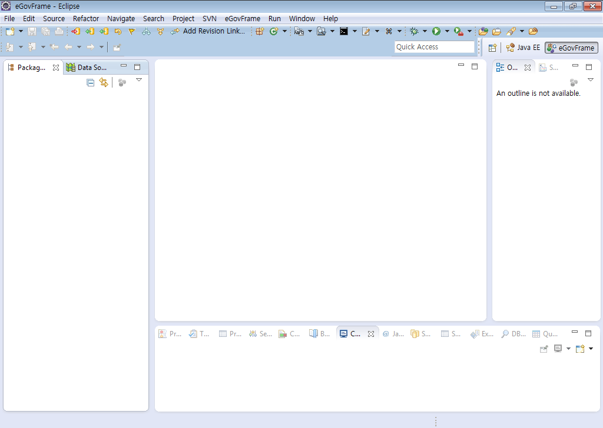  

### 퍼스펙티브; 화면 레이아웃
화면에 에디터를 중심으로 한 뷰의 레이아웃을 볼 수 있는데, 이렇게 작업별로 구성된 레이아웃을 
퍼스펙티브라고 합니다. 상단의 메뉴, 툴바, 하단의 상태바, 중간에는 뷰와 에디터가 위치합니다. 
뷰와 에디터는 탭을 마우스로 드래그해서 위치를 이동할 수 있습니다.  
<그림> 퍼스펙티브 구성 요소  
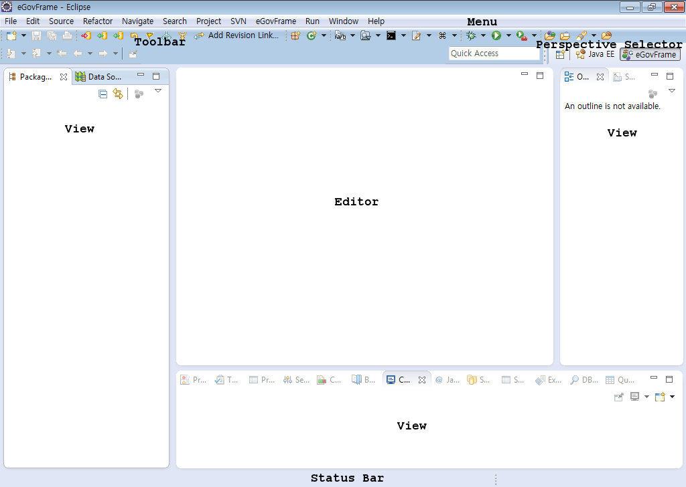  

### 프로젝트 생성
이클립스는 울트라에디트나 에디트플러스 같은 텍스트 편집기와는 달리 개별 파일 단위가 아닌 
프로젝트 단위로 파일을 관리합니다. 클래스 참조 등 파일 간의 유기적인 관계를 더 이용할 수 있다는 
뜻입니다. 

우선 표준프레임워크 프로젝트를 만들어 보겠습니다. 좌측 상단의 툴바 첫 아이콘을 클릭합니다.  
<그림> New 툴바 버튼  
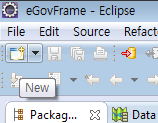

이어 나오는 창에서 web이라고 입력하면 필터링됩니다. eGovFrame Web Project 항목을 선택하고 
Next 버튼을 클릭합니다.  
<그림> eGovFrame 웹 프로젝트  
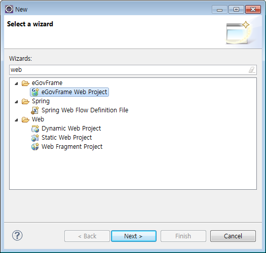

프로젝트 명칭은 메이븐에서 요구되는 그룹 ID와 아티팩트 ID 때문에 .으로 연결해서 구성합니다. 
ok.egov 라고 입력하면 하단의 Maven Setting쪽에 구분되어 나오게 됩니다. Next 버튼을 
눌러서 다음 단계로 이동합니다.  
<그림> 프로젝트 이름  
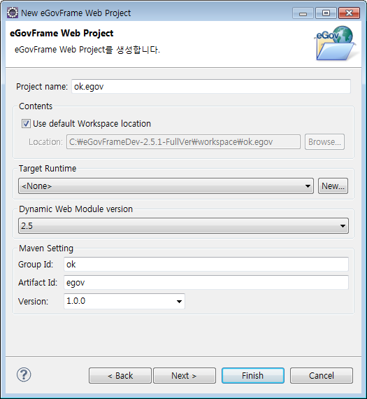

간단한 게시판 구조의 샘플 코드가 준비되어 있습니다. Generate Example 항목을 체크하면 
프로젝트 생성과 동시에 샘플 코드도 함께 만들어집니다.  

<그림> 프로젝트 샘플 코드  
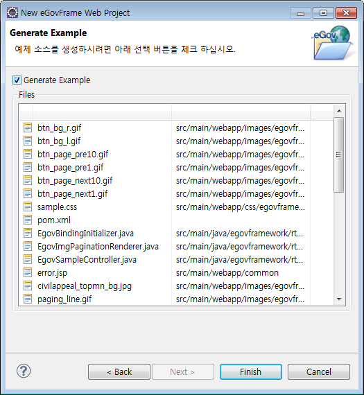

만들어진 프로젝트의 구조는 그림과 같습니다. 자바 소스 폴더가 4가지 보입니다. 이 구조는 메이븐 
빌드 도구에서 일반적으로 사용하는 폴더 구조입니다.  
<그림> 프로젝트 샘플 코드 구조  
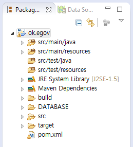

샘플 소스 관련된 설명은 차후로 미루고, 일단 웹 프로젝트의 실행을 위한 톰캣 서버를 연결하겠습니다.

###  톰캣 서버 설정

웹 프로젝트를 실행하기 위해서 톰캣이 필요합니다. 개발환경 서버에는 톰캣6이 함께 포함되어 
있습니다. 이 톰캣을 연결해서 앞에서 생성한 샘플 프로젝트를 실행해 보겠습니다.

이클립스 하단의 여러 뷰 중에서 Servers 뷰를 선택합니다. new server wizard 링크를 
클릭하면 새로운 창이 나타납니다.
<그림> 서버 뷰  
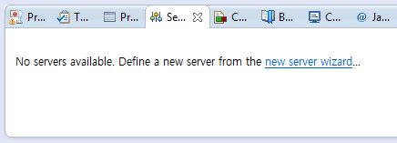

tom 이라고 입력하면 Tomcat 이라는 서버들이 보입니다. Tocmat v6.0 Server을 선택합니다. 
Next 버튼을 눌러 다음 단계로 이동합니다.  
<그림> 새로운 서버 정하기  
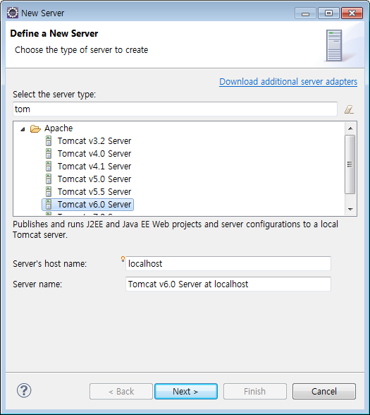

Browse... 버튼을 누르면 새로운 창이 뜹니다. 개발환경 서버에 설치된 톰캣 경로를 찾습니다. 
C:\eGovFrameSvr\tomcat6 입니다.  
<그림> 톰캣6 서버 경로 찾기  
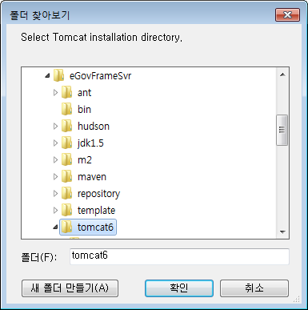

경로가 맞게 설정되었는지 확인합니다. Finish 버튼을 클릭해서 설정을 종료합니다.  
<그림> 톰캣6 서버 경로 설정  
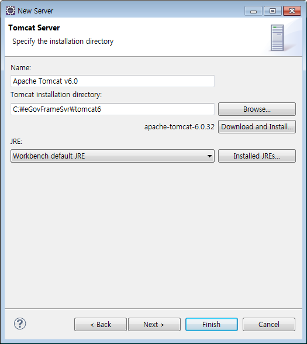

이클립스에서 톰캣6로 연결할 경우 설정 정보가 있는 톰캣의 conf 폴더가 워크스페이스의 
Servers 프로젝트 하위로 복사됩니다.  
<그림> 서버 프로젝트    
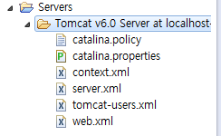

개발환경 서버에 있는 톰캣6의 포트는 7070을 사용합니다. 이것을 8080 포트로 바꿔서 
두 개의 톰캣이 한 시스템에서 동작할 수 있도록 하겠습니다. 서버 탭에 나타난 
Tomcat v6.0 Server at localhost 를 더블클릭합니다. 편집기 영역에 그림과 같이 
파일이 불려집니다.  
<그림> 톰캣 서버 설정  
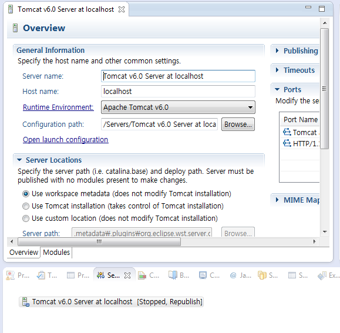

서버 설정 화면 우측에 Ports 항목이 보일 것입니다. 7071을 8081로, 7070을 8080으로 
변경하고 저장하시면 됩니다. ctrl+S로 저장할 수 있습니다. 나중에 변경할 경우, 톰캣이 
실행 중이면 저장되지 않기 때문에 저장하기 전에 실행중인 톰캣을 정지해야 합니다.

<그림> 톰캣 포트 변경  
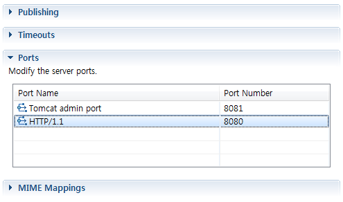

### 프로젝트 실행
톰캣 서버 설정을 마쳤으면 이제 샘플로 만들어진 프로젝트를 실행할 수 있습니다. 프로젝트 
ok.egov를 선택하고 컨텍스트 메뉴 > Run As > Run on Server 항목을 선택합니다.

<그림> 웹 프로젝트 실행
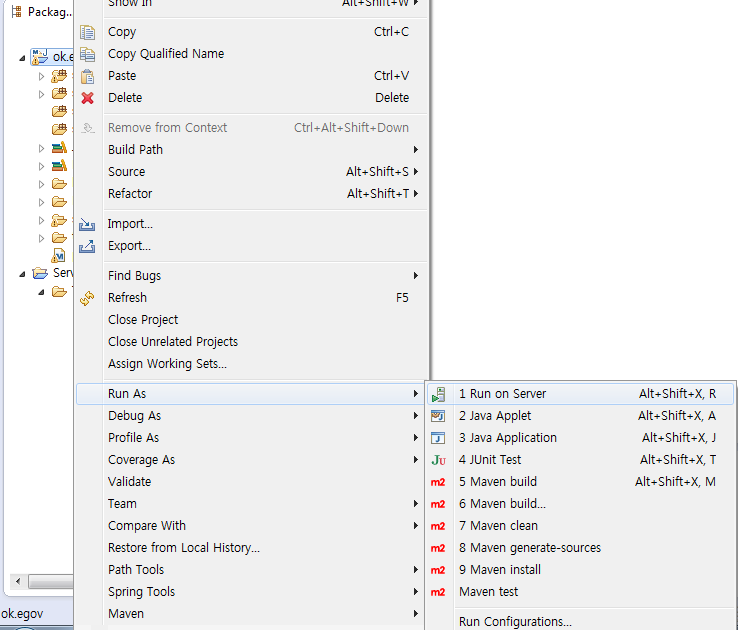

서버를 선택하는 창이 나타납니다. 목록에 있는 서버를 선택하고 Finish 버튼을 클릭합니다. 
8080포트를 사용하는 서버가 시작됩니다.

<그림> 실행 서버 선택  
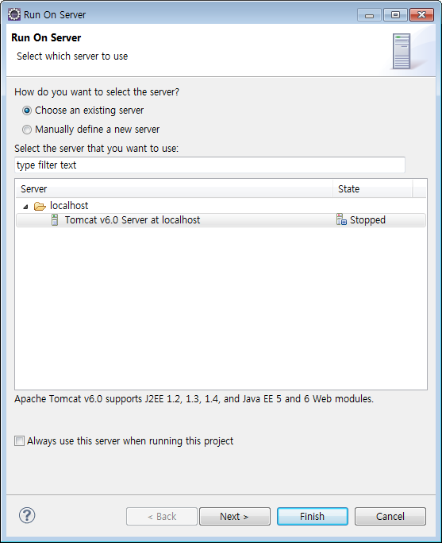

이클립스에 웹 뷰가 나타나면서 샘플 프로젝트 http://localhost:8080/egov/ 웹페이지를 
호출합니다. 샘플 프로젝트는 DB를 호출하게 되어 있습니다. DB 서버에 접속할 수 없어서 
"Could not open JDBC Connection ..." 메시지를 보게 됩니다. 지금까지 잘 따라오신 
것입니다. 다음으로 DB 서버를 시작해보겠습니다. 참고로 경우에 따라 몇 가지 예외가 발생하게 
되는데, 이 절의 마지막에 예외 처리를 위한 방법들을 알려드리겠습니다.

<그림> JDBC 연결 에러 메시지  
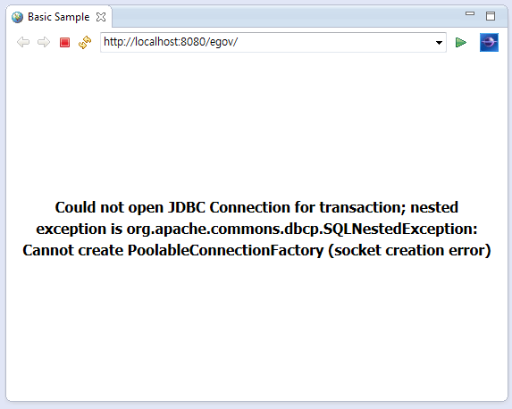  

ok.egov 프로젝트 폴더에 DATABASE/db 가 있습니다. db 폴더를 펼쳐 보면 여러 sql 관련 
파일들을 볼 수 있습니다. 여기서 hsqldb라는 경량 파일 DB를 실행해 보겠습니다. db폴더를 
선택합니다. 이 경로를 쉽게 이동하기 위해서 pathtool이라는 플러그인 기능을 사용합니다.

<그림> db 폴더  
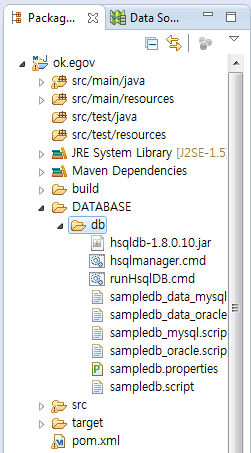  

이클립스 상단 툴바에서 까만 아이콘을 클릭합니다. 선택된 경로로 커맨드 창을 띄워주는 기능입니다.

<그림> pathtool 커맨드 창 아이콘  
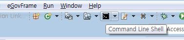

커맨드 창이 hsqlDB를 실행할 수 있는 db 폴더에 경로가 맞춰져서 뜹니다. runHSqlDB.cmd 
파일을 실행할 것입니다. run이라고 입력하고 키보드 좌측의 탭키를 치면 나머지 이름이 자동으로 
완성됩니다. 엔터를 눌러 hsqlDB를 실행합니다. 만약 종료하기 원하면 이 커맨드 창을 닫아버리거나, 
이 창에서 ctrl+C를 입력하면 hsqlDB가 정지됩니다.
DB 실행을 확인했다면 에러가 발생했던 화면으로 가서 새로 페이지를 호출해 봅니다.  
  
<그림> hsqlDB 실행  
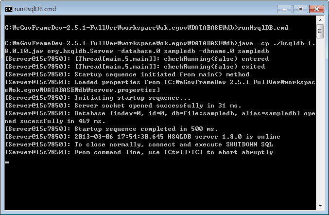  

hsql 데이터베이스가 실행된 후에 화면을 새로고침 아이콘을 통해서 갱신하면 목록이 나타납니다. 
데이터에 입력과 조화가 가능한 간단한 예제입니다. 이후에 이 예제를 통해서 스프링 프레임워크의 
기본을 알아보겠습니다.  
<그림> 샘플 프로젝트 실행 화면  
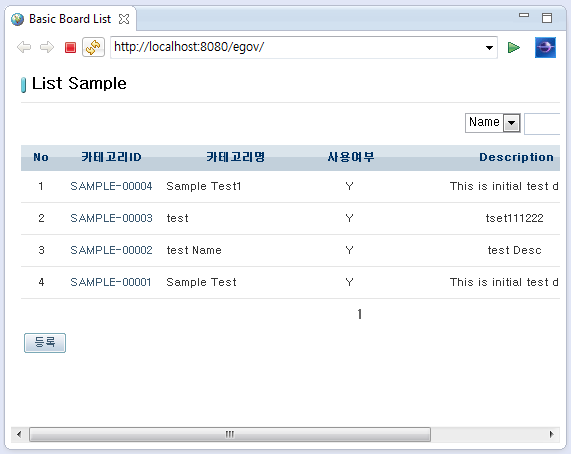  

톰캣 서버를 정지하기 위해서는 서버 탭에서 정지를 원하는 서버를 선택하고 빨간 아이콘을 클릭하면 
shutdown 명령을 실행한 것처럼 정지됩니다. 모니터 아이콘의 콘솔 탭에서도 빨간 아이콘이 있는데, 
프로세스를 kill하는 효과가 있습니다. 이 경우 종료 절차를 거치지 않고, 바로 종료됩니다. 
시작 아이콘과 디버그 아이콘을 통해서 톰캣을 다시 시작할 수 있습니다.  
<그림> 톰캣 서버 시작과 정지  
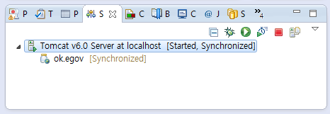  

### 웹 애플리케이션 배포 에러 대응

표준프레임워크 개발도구 사용시 발생되는 몇 가지 에러 상황이 있습니다. 웹 애플리케이션에 오류가 있는 경우 404 에러가 발생하는 경우와 m2eclipse 플러그인의 버그로 resources 폴더가 배포되지 않는 경우 두 가지를 설명하겠습니다.

콘솔 뷰에 그림과 같이 Class를 찾을 수 없다고 에러가 나는 경우는 빌드가 제대로 되지 않은 경우입니다.  
<그림> 클래스를 찾지 못하는 예외  
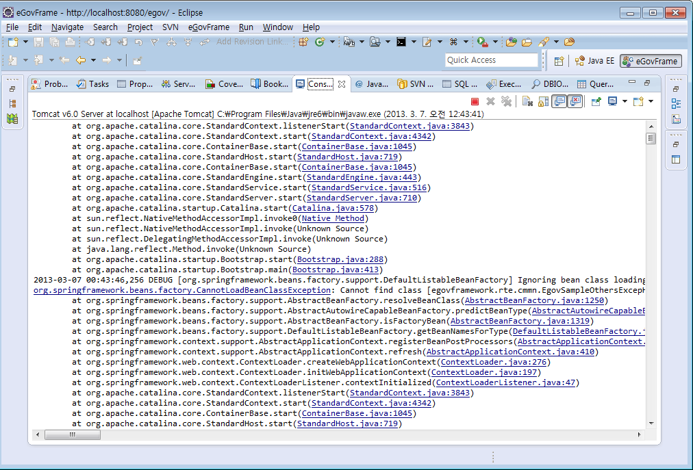  
<그림> 클래스를 찾지 못하는 예외 2  
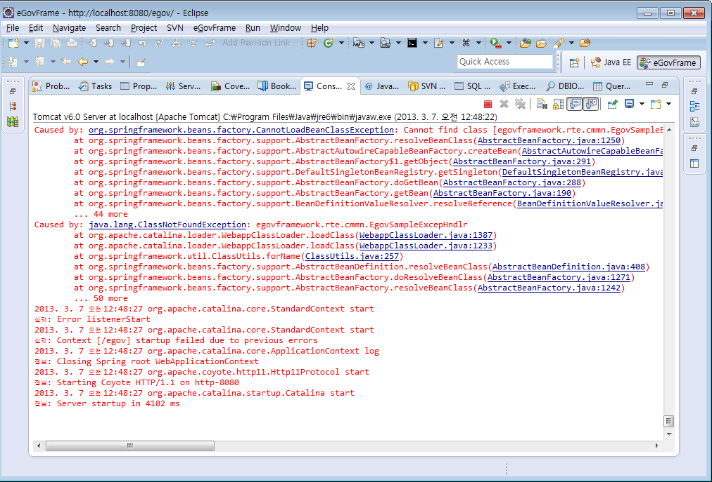  
브라우저에는 404 에러를 표시하고, 프로젝트의 다른 파일 경로도 404로 나타나지 않습니다. 이런 경우 Context 전체가 웹앱으로 등록되지 못해서 발생하는 경우입니다. web.xml 파일에 등록된 클래스를 찾지 못하는 경우도 같은 상황이 발생하게 됩니다.  
<그림> 404 Page Not Found  
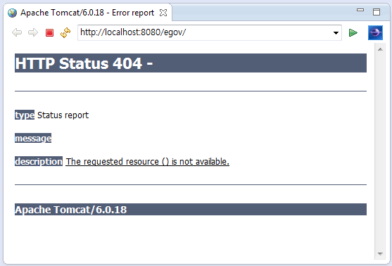  

이런 경우 프로젝트를 다시 빌드해줍니다. 그리고, 등록된 웹 앱을 톰캣에서 제거했다가 다시 등록하고, 배포된 소스 폴더와 톰캣의 work폴더를 지워주는 작업도 함께 합니다. 이에 대한 방법을 설명하겠습니다.  
서버 뷰의 톰캣 하위에 보면 ok.egov 프로젝트가 연결되어 있는 것이 보입니다. ok.egov를 선택하고 컨텍스트 메뉴에서 Remove를 선택하면 톰캣과 프로젝트의 연결이 제거됩니다. 프로젝트를 다시 실행하면 재등록되기 때문에 지우는 것에 부담을 가질 필요는 없습니다.  
<그림> 프로젝트 연결 끊기  
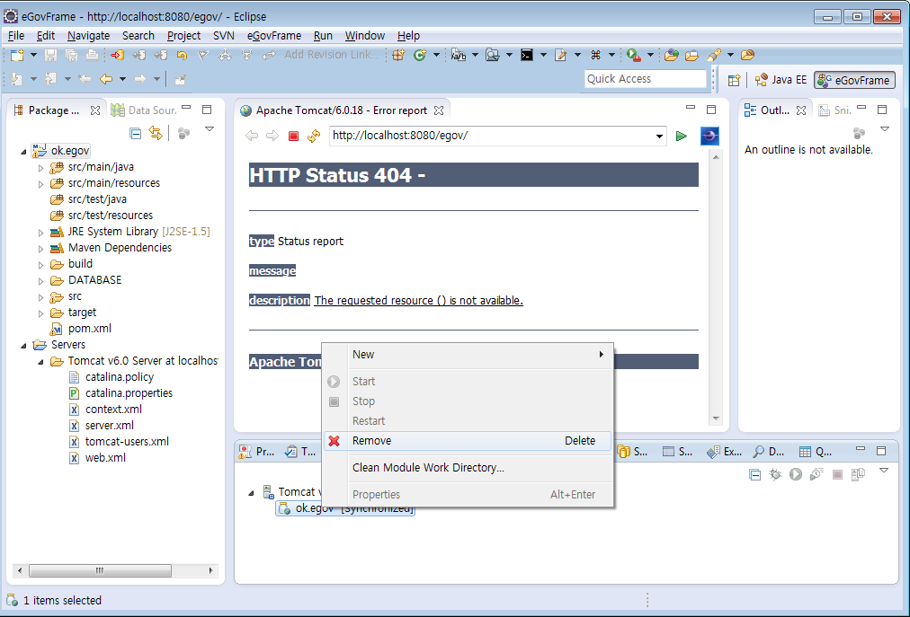  

우선 프로젝트의 빌드를 다시 합니다. 기존에 컴파일된 클래스를 다 지우고, 새로 컴파일하는 것입니다. 컴파일과 리소스의 복사 과정이 포함된 빌드를 다시 수행하면 누락된 클래스를 포함할 수 있습니다. 이클립스 좌측 Project Explorer에서 ok.egov 프로젝트를 선택합니다. 메뉴의 Project > Clean...을 선택합니다.  
<그림> 프로젝트 Clean...  
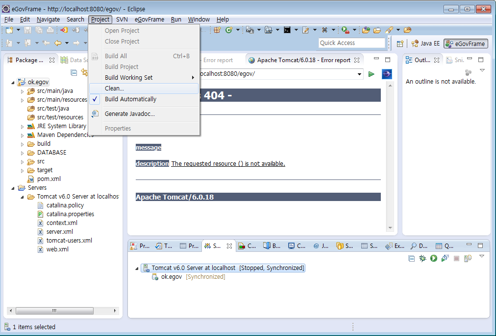  

이어서 나오는 창에서 프로젝트를 선택합니다. 전체를 선택하면 워크스페이스의 모든 프로젝트를 전부 다시 빌드합니다. 우측에 있는 선택한 프로젝트만 다시 빌드 라디오 버튼을 클릭하고 ok.egov 프로젝트를 선택합니다. OK 버튼을 클릭하면 다시 빌드가 이루어집니다.  

<그림> 다시 빌드할 프로젝트 선택  
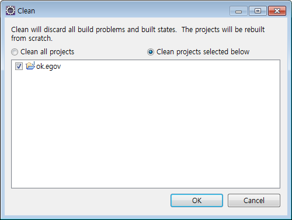  

그리고 톰캣에 배포된 소스를 지워줍니다. 서버 뷰에서 톰캣을 선택하고 컨텍스트 메뉴에서 Clean 항목을 선택합니다. 이클립스 워크스페이스에서 톰캣 서버가 사용하는 위치로 코드가 배포되어서 실행되는데 .metadata/.plugins/org.eclipse.wst.server.core/tmp0/wtpwebapps 폴더 하위에 배포됩니다. 여기 있는 코드를 지우고 다시 배포하는 작업입니다.  
<그림> 톰캣 Clean...  
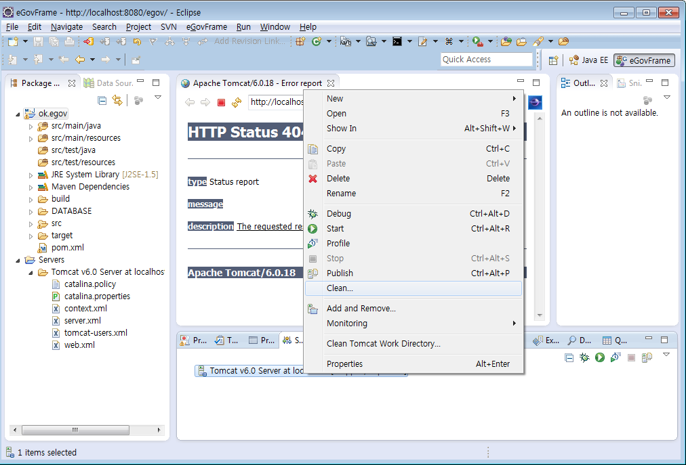  

JSP를 실행할 경우 자동으로 서블릿 java로 변환되고, 이것을 컴파일해서 클래스를 만들어 실행합니다. 이 때 작업 파일이 위치하는 폴더가 work입니다. 이 폴더 또한 비우는 과정입니다. 서버 뷰에서 톰캣을 선택하고 컨텍스트 메뉴에서 Clean tomcat Work Directory...를 선택합니다.  
<그림> 톰캣 Work 폴더 지우기  
  

이 과정을 거치면 프로젝트를 깨끗이 빌드하게 됩니다.  

### Deployment Assembly 이슈  

m2eclipse 플러그인에서 프로젝트의 resources 폴더가 누락되는 버그가 가끔 발생합니다. 정상적으로 생성된다면 그림과 같이 되어야 합니다.
<그림> 정상적인 Deployment Assembly 설정  
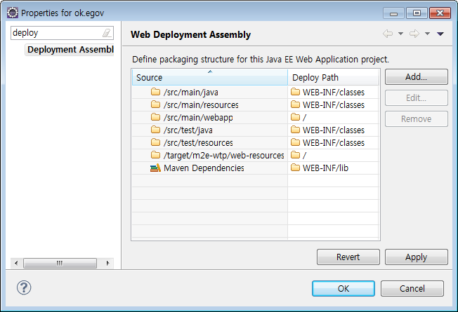  

그러나 잘못 설정된 경우는 여러 항목이 빠져 있습니다. 때문에 빌드 시에 properties 같은 파일들이 포함되지 않아서 프로젝트가 실행되지 않게 됩니다.  
<그림> 누락된 Deployment Asembly 설정  
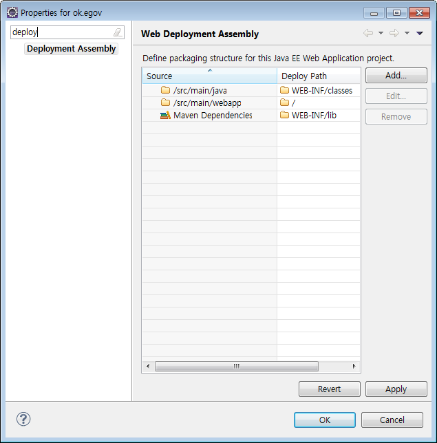  

설정화면을 보기 위해서는 ok.egov 프로텍트를 선택하고, 프로젝트의 속성 메뉴를 선택합니다. 메뉴에서 Project > Properties를 선택합니다.
<그림> 프로젝트 속성 메뉴  
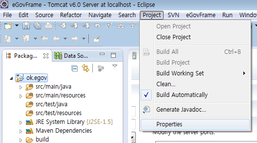  

우측의 Add 버튼을 클릭하고 Folder를 선택합니다. Next 버튼을 클릭해서 다음 과정으로 진행합니다.  
<그림> 폴더 선택  
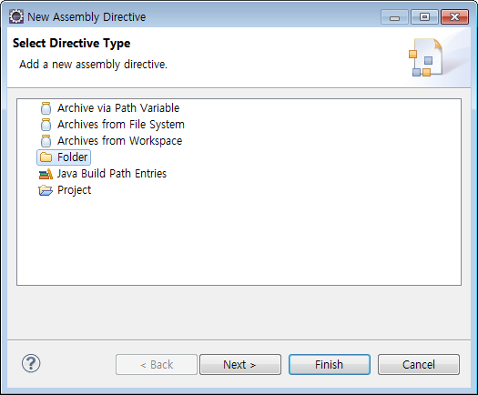

src > main > resources 폴더를 추가합니다. Finish 버튼을 클릭해서 폴더 선택을 마칩니다.
<그림> resources 폴더 선택  
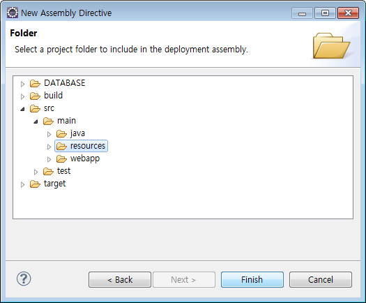  

소스 폴더에 해당하는 배치 경로를 설정합니다. /src/main/resources 항목의 Deploy Path를 선택하고 WEB-INF/classes 경로를 입력합니다. 위에 있는 항목을 복사해서 붙여넣어도 됩니다.
<그림> 배치 경로  
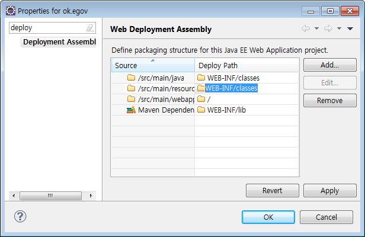  

프로젝트를 다시 빌드하고 실행하면 정상적으로 샘플 프로젝트가 실행될 것입니다. 
<그림> 샘플 프로젝트 정상 실행시 로그  
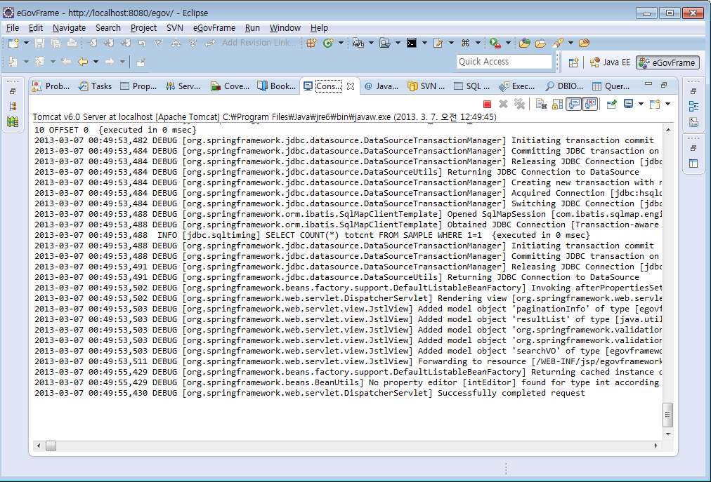  

다른 원인이 있다면 로그 화면에 따라서 구글 등의 검색엔진을 통해서 해결의 실마리를 찾아야 할 것입니다. 

### 메이븐, 빌드 도구  

메이븐은 아파치의 오픈 소스 빌드 도구입니다. [http://maven.apache.org](http://maven.apache.org) 사이트에서 정보를 구할 수 있습니다. 빌드란 프로그램 소스의 컴파일을 포함해서 애플리케이션을 사용할 수 있도록 패키징까지 해주는 과정입니다. 개발환경 도구에는 메이븐의 이클립스 플러그인이 함께 설치되어 있습니다. m2eclipse라는 플러그인이며, 이클립스에서 메이븐을 쉽게 사용하도록 도와주는 기능을 제공합니다.

#### 메이븐 프로젝트 소스 구조
메이븐은 설정보다 관례(CoC;Convention over Configuration)라는 컨셉으로, 먼저 나왔던 ANT(http://ant.apache.org) 빌드 도구와 달리 빌드의 설정을 자유롭게 하는 대신 지정된 규칙에 따라 코드를 위치시키면 컴파일, 패키징, 문서화 등의 나머지 작업들을 자동으로 수행해 줍니다.  


#### 자바 라이브러리 일괄 관리  
메이븐은 여러 프로젝트에 중복 산재해 있는 자바 라이브러리(JAR)를 한 곳에서 관리합니다. 일반적으로 프로젝트에서 소스코드가 차지하는 용량이 3~5메가라고 하면 jar파일의 크기는 30~50메가가 넘는 경우가 많습니다. 이런 경우 버전관리 시스템에서 제외시켜서 관리할 수 있다면 매우 가볍게 작업이 가능합니다.  
메이븐은 사용자 홈 디렉토리를 기준으로 .m2 라는 폴더를 만들어서 repository 폴더 하위에 인터넷에서 다운로드 받은 jar 파일을 관리합니다. pom.xml 에서 지정된 라이브러리들을 필요에 따라 복사하거나 참조해서 사용합니다.  


#### 메이븐 간단 테스트  


## 개발환경 서버

### 서브버전, 소스 버전 관리 도구

### 허드슨, 지속적인 통합 도구  

### 넥서스, 라이브러리 저장소  

## 개발환경 도구

### 코드 네비게이션  

### 디버깅  

### 편집도구  

## 실행환경

### 실행환경 개요  

### 스프링 프레임워크  

### 스프링 IoC/DI  

### 스프링 MVC  

## 실행환경 구성

### iBatis와 데이터베이스  

### 오픈소스 프로젝트 소개

## 공통 컴포넌트  

### 공통 컴포넌트 구성  

## 모바일 표준프레임워크  

### 모바일 표준프레임워크 구성  

