# 전자정부 표준프레임워크

## 개요

전자정부 표준프레임워크는 국내 SI 프로젝트의 수행을 돕기 위해서 오픈소스를 패키징하고, 
국내 SI 프로젝트를 분석해서 도출해 낸 200여 가지 공통 컴포넌트 소스 템플릿을 더한 
오픈소스 프로젝트입니다.

대형 SI 회사가 아닌 중소규모의 회사에서 공공기관이나 민간 프로젝트를 수행할 때 도움이 
되도록 구성되어 있습니다. 스프링 프레임워크와 이클립스 개발도구를 통해서 개발생산성을 
높일 수 있으며, ALM(Application Lifecycle Management) 관점에서 
소스버전관리를 위해 서브버전, 지속적인 통합을 위해 허드슨, 손쉬운 빌드를 위해서 메이븐을 
이용하고 있습니다. 

### 전자정부 표준프레임워크 아키텍처

전자정부 표준프레임워크(이하 표준프레임워크)는 이클립스 개발도구 중심의 개발환경, 스프링 
프레임워크 중심의 실행환경, 서비스요청관리를 위한 관리환경, 모니터링 도구를 중심으로 한 
운영환경, 그리고 공통적으로 재사용이 가능한 기능위주로 개발한 컴포넌트의 집합인 
공통컴포넌트로 구성되어 있습니다. 2.0 버전부터는 jQueryMobile 중심의 모바일 
프레임워크가 추가되었습니다.

<그림> 표준프레임워크 구성 (2.5)  


## 개발환경

실행환경 개발을 위한 개발환경을 먼저 살펴보겠습니다.

### 표준프레임워크 개발환경 다운로드

개발환경을 구성하기 위해 필요한 파일을 다운로드해야 합니다. 
[http://www.egovframe.go.kr](http://www.egovframe.go.kr) 사이트에 
접속합니다. 로그인 후에 다운로드 받을 수 있기 때문에, 먼저 회원가입을 마칩니다. 
로그인 하고, 상단 메뉴의 다운로드를 선택합니다. 개발환경 메뉴를 선택하면 다운로드할 
수 있는 목록이 보입니다.

<그림> 개발환경 다운로드 페이지  


### 개발환경 2.5.1 다운로드

페이지 중간으로 내려 보면 개발환경 링크 목록이 나옵니다. 1.0.0과 2.0.1의 이전 
버전들도 다운로드 링크가 있습니다. Light Version과 Full Version으로 나뉘어 
있는데, 모바일 개발환경이 필요하지 않다면 Light Version을 받으면 조금 가벼운 
개발도구를 다운로드 받을 수 있습니다. 
책에서는 "개발자용 개발환경(Implementation Tool) Full Version 2.5.1"을 
기준으로 설명하겠습니다.

<그림> 개발환경 다운로드 목록  


### 다운로드 상세 페이지

로그인 후에 상세페이지로 이동해서 Full Version을 다운로드합니다. 설명에도 있지만 
이클립스의 여러 가지 플러그인들이 설치되어 있는 통합 개발도구입니다.

> 개발자용 개발환경(Implementation Tool) Full Version은 개발자의 코드 작성을 
> 지원하는 도구로써, eGovFrame기반의 어플리케이션 개발을 지원하는 IDE와 
> Editor(SourceCode, UML, ERD, DBIO, WebFlow, Code Generation, 
> Code Inspection, 공통컴포넌트 생성, 맞춤형 개발환경, Nexus, SVN)와 
> Debug(Local, Remote), Mobile IDE, Batch IDE, RDT로 구성되어 있습니다.

일반적인 이클립스 Java EE 패키지가 230MB 정도인데, 2.5배의 크기입니다.

<그림> 개발환경 Full Version 2.5.1 상세 페이지  


네트워크마다 속도가 다릅니다만 대략 5~10분 정도가 소요됩니다.

<그림> 개발환경 Full Version 2.5.1 다운로드  


### 개발환경 도구 설치

다운로드 받은 eGovFrameDev-2.5.1-FullVer.zip 파일의 압축을 풉니다. 
eGovFrameDev-2.5.1-FullVer 폴더를 C:\ 경로로 이동합니다. 
C:\eGovFrameDev-2.5.1-FullVer 폴더 안에 eclipse 와 workspace가 보이면 
제대로 위치를 잡았습니다.

<그림> 개발환경 도구 설치 위치  


### 개발환경 서버 설치

실행하기 전에 다음 장에서 설명할 개발환경 서버를 먼저 설치합니다. 개발도구를 실행하기 
위한 jdk(Java Development Kit; 자바 개발 도구)가 함께 있기 때문입니다. 물론 
개발환경 서버 없이도 jdk가 설치되어 있다면 개발환경 도구만으로도 작업이 가능합니다. 
책에서는 개발환경 서버를 먼저 설치하고 이용하도록 설명하겠습니다. 다운로드 목록 
페이지에서 "개발환경 2.0.0 다운로드" 그룹을 보면 서버용 개발환경을 볼 수 있습니다.
윈도우를 기준으로 설명합니다.

<그림> 개발환경 2.0.0 서버용 개발환경  


"서버용 개발환경(Development Tool - Windows) Version 2.0.0" 링크를 
클릭하고 이동하면 첨부파일이 두 가지 보입니다. eGovFrameSvr_win.2.0.0.exe 
파일과 eGovFrameSvr_Installer_가이드.docx 파일입니다. 가이드 문서 파일에는
윈도우와 리눅스 모두 설명이 되어 있습니다.

<그림> 서버용 개발환경 윈도우 버전  


설치는 기본설정 그대로 진행합니다. 윈도우7일 경우 관리자 권한이 필요합니다. 설치를 
하게 되는 컴포넌트들은 그림과 같습니다. Tomcat, Hudson, Subversion, Maven,
Nexus 입니다. 여기 목록에는 없지만 Ant와 JDK가 포함되어 있습니다.

<그림> 서버용 개발환경 구성 컴포넌트  


설치 경로는 기본값이 C:\eGovFrameSvr 입니다. bin 폴더 안에는 비어있지 않고, 
톰캣과 svn을 실행할 수 있는 스크립트가 있습니다. repository 폴더는 서브버전의 
소스가 위치하는 공간입니다. 자세한 설명은 다음 장으로 미루고, 자바 개발에서 가장 
중요한 환경 변수 JAVA_HOME과 Path를 설정하겠습니다.

<그림> 서버용 개발환경 설치 위치  


### 환경 변수 설정

환경 변수란 시스템에서 활용되는 변수를 뜻합니다. 윈도우에서는 환경 변수를 컴퓨터 속성 > 
고급 시스템 설정 > 고급 탭 > 환경 변수 > 시스템 변수 > 새로 만들기 순서로 접근해서 
만들 수 있습니다.  
윈도우 탐색기에서 컴퓨터를 선택합니다. 컨텍스트 메뉴(마우스 오른 버튼 클릭시 나오는 메뉴, 
문맥에 따라 항목이 바뀌는 메뉴)에서 속성을 선택합니다.  
<그림> 컴퓨터 속성    
  

시스템 창에서 왼쪽 메뉴들 중 고급 시스템 설정을 클릭합니다. 윈도우XP에서는 바로 다음으로 
넘어갑니다.  
<그림> 고급 시스템 설정    
  

상단 탭 중에서 고급 탭을 선택합니다. 아래에 환경 변수 버튼이 보이고, 그 버튼을 클릭해서 
환경 변수를 수정할 수 있는 창으로 이동합니다.  
<그림> 고급, 환경 변수    
  

사용자 변수와 하단에 시스템 변수로 나뉘어 있습니다. 윈도우는 일반적으로 사용자가 시스템을 
관리할 수 있는 시스템 권한을 갖고 있기 때문에 시스템 변수를 변경하겠습니다. 시스템 변수 쪽에 
있는 새로 만들기 버튼을 클릭합니다.  
<그림> 시스템 변수  
  

새 시스템 변수 이름을 JAVA_HOME 그리고 변수 값에는 jdk 폴더 경로를 입력합니다. 
C:\eGovFrameSvr\jdk1.5 를 변수 값으로 넣었습니다.  
<그림> 환경 변수 JAVA_HOME  
  

JAVA_HOME 환경 변수 추가한 후에 이를 이용한 Path 환경 변수를 수정합니다. Path를 
선택하고 편집 버튼을 클릭합니다.   
<그림> 환경 변수 Path    
  

변수 값 제일 앞으로 이동해서 %JAVA_HOME%\bin; 를 추가합니다. JAVA_HOME 환경 변수 앞 
뒤로 %를 붙여서 사용하고, 그 뒤에 \bin폴더를 더합니다. ;(세미콜론)으로 폴더값 간에 구분을 
짓습니다. Path는 시스템 어디 위치에서든 접근할 수 있는 경로들이 모아진 환경 변수입니다.  
<그림> 환경 변수 Path, %JAVA_HOME%\bin;    
  

이제 환경 변수 설정은 모두 마쳤습니다. 정리하자면 JAVA_HOME의 bin 폴더에 있는 자바 관련 
파일들을 시스템 어디에서나 접근하기 위한 환경을 마련하는 절차였습니다. 이제 표준프레임워크를 
시작할 준비가 다 되었습니다.

### 개발환경 도구 시작

자바가 실행될 수 있는 환경이 준비되었다면 표준프레임워크 개발 도구를 시작할 수 있습니다. 
윈도우 탐색기에서 C:\eGovFrameDev-2.5.1-FullVer\eclipse 폴더로 이동해서 
eclipse.exe 파일을 실행합니다.  
<그림> 개발환경 도구 경로  
  

이클립스 이미지 대신 행안부 로고가 좌측 상단에 보이는 표준프레임워크 2.5 스플래시 이미지가 
보입니다.  
<그림> 개발환경 도구 스플래시  
  

워크스페이스를 설정하는 창이 뜹니다. C:\eGovFrameDev-2.5.1-FullVer\workspace 경로를 
확인합니다. OK 버튼을 클릭하고 이클립스를 띄웁니다. 

```
워크스페이스(workspace):  
프로젝트 그룹의 기준 디렉토리가 워크스페이스입니다. 소스 파일들이 위치하게 됩니다. 
참고로 워크스페이스마다 .metadata 라는 폴더를 포함하는데, 여기에 이클립스의 설정 정보가 
저장됩니다. 이 때문에 워크스페이스를 변경하면 이클립스를 리셋하는 효과가 나타납니다.
```

<그림> 워크스페이스 경로  
  

이클립스가 시작되었습니다. 다른 이클립스 패키지와 다른 것은 eGovFrame 퍼스펙티브로 되어 있고, 
메뉴에 eGovFrame이 보입니다. 표준프레임워크에서 제공하는 기능들을 접근하는 통로가 됩니다.   
<그림> 이클립스 개발 도구 실행  
  

### 퍼스펙티브; 화면 레이아웃
화면에 에디터를 중심으로 한 뷰의 레이아웃을 볼 수 있는데, 이렇게 작업별로 구성된 레이아웃을 
퍼스펙티브라고 합니다. 상단의 메뉴, 툴바, 하단의 상태바, 중간에는 뷰와 에디터가 위치합니다. 
뷰와 에디터는 탭을 마우스로 드래그해서 위치를 이동할 수 있습니다.  
<그림> 퍼스펙티브 구성 요소  
  

### 프로젝트 생성
이클립스는 울트라에디트나 에디트플러스 같은 텍스트 편집기와는 달리 개별 파일 단위가 아닌 
프로젝트 단위로 파일을 관리합니다. 클래스 참조 등 파일 간의 유기적인 관계를 더 이용할 수 있다는 
뜻입니다. 

우선 표준프레임워크 프로젝트를 만들어 보겠습니다. 좌측 상단의 툴바 첫 아이콘을 클릭합니다.  
<그림> New 툴바 버튼  


이어 나오는 창에서 web이라고 입력하면 필터링됩니다. eGovFrame Web Project 항목을 선택하고 
Next 버튼을 클릭합니다.  
<그림> eGovFrame 웹 프로젝트  


프로젝트 명칭은 메이븐에서 요구되는 그룹 ID와 아티팩트 ID 때문에 .으로 연결해서 구성합니다. 
ok.egov 라고 입력하면 하단의 Maven Setting쪽에 구분되어 나오게 됩니다. Next 버튼을 
눌러서 다음 단계로 이동합니다.  
<그림> 프로젝트 이름  


간단한 게시판 구조의 샘플 코드가 준비되어 있습니다. Generate Example 항목을 체크하면 
프로젝트 생성과 동시에 샘플 코드도 함께 만들어집니다.  

<그림> 프로젝트 샘플 코드  


만들어진 프로젝트의 구조는 그림과 같습니다. 자바 소스 폴더가 4가지 보입니다. 이 구조는 메이븐 
빌드 도구에서 일반적으로 사용하는 폴더 구조입니다.  
<그림> 프로젝트 샘플 코드 구조  


샘플 소스 관련된 설명은 차후로 미루고, 일단 웹 프로젝트의 실행을 위한 톰캣 서버를 연결하겠습니다.

###  톰캣 서버 설정

웹 프로젝트를 실행하기 위해서 톰캣이 필요합니다. 개발환경 서버에는 톰캣6이 함께 포함되어 
있습니다. 이 톰캣을 연결해서 앞에서 생성한 샘플 프로젝트를 실행해 보겠습니다.

이클립스 하단의 여러 뷰 중에서 Servers 뷰를 선택합니다. new server wizard 링크를 
클릭하면 새로운 창이 나타납니다.
<그림> 서버 뷰  


tom 이라고 입력하면 Tomcat 이라는 서버들이 보입니다. Tocmat v6.0 Server을 선택합니다. 
Next 버튼을 눌러 다음 단계로 이동합니다.  
<그림> 새로운 서버 정하기  


Browse... 버튼을 누르면 새로운 창이 뜹니다. 개발환경 서버에 설치된 톰캣 경로를 찾습니다. 
C:\eGovFrameSvr\tomcat6 입니다.  
<그림> 톰캣6 서버 경로 찾기  


경로가 맞게 설정되었는지 확인합니다. Finish 버튼을 클릭해서 설정을 종료합니다.  
<그림> 톰캣6 서버 경로 설정  


이클립스에서 톰캣6로 연결할 경우 설정 정보가 있는 톰캣의 conf 폴더가 워크스페이스의 
Servers 프로젝트 하위로 복사됩니다.  
<그림> 서버 프로젝트    


개발환경 서버에 있는 톰캣6의 포트는 7070을 사용합니다. 이것을 8080 포트로 바꿔서 
두 개의 톰캣이 한 시스템에서 동작할 수 있도록 하겠습니다. 서버 탭에 나타난 
Tomcat v6.0 Server at localhost 를 더블클릭합니다. 편집기 영역에 그림과 같이 
파일이 불려집니다.  
<그림> 톰캣 서버 설정  


서버 설정 화면 우측에 Ports 항목이 보일 것입니다. 7071을 8081로, 7070을 8080으로 
변경하고 저장하시면 됩니다. ctrl+S로 저장할 수 있습니다. 나중에 변경할 경우, 톰캣이 
실행 중이면 저장되지 않기 때문에 저장하기 전에 실행중인 톰캣을 정지해야 합니다.

<그림> 톰캣 포트 변경  


### 프로젝트 실행
톰캣 서버 설정을 마쳤으면 이제 샘플로 만들어진 프로젝트를 실행할 수 있습니다. 프로젝트 
ok.egov를 선택하고 컨텍스트 메뉴 > Run As > Run on Server 항목을 선택합니다.

<그림> 웹 프로젝트 실행


서버를 선택하는 창이 나타납니다. 목록에 있는 서버를 선택하고 Finish 버튼을 클릭합니다. 
8080포트를 사용하는 서버가 시작됩니다.

<그림> 실행 서버 선택  


이클립스에 웹 뷰가 나타나면서 샘플 프로젝트 http://localhost:8080/egov/ 웹페이지를 
호출합니다. 샘플 프로젝트는 DB를 호출하게 되어 있습니다. DB 서버에 접속할 수 없어서 
"Could not open JDBC Connection ..." 메시지를 보게 됩니다. 지금까지 잘 따라오신 
것입니다. 다음으로 DB 서버를 시작해보겠습니다. 참고로 경우에 따라 몇 가지 예외가 발생하게 
되는데, 이 절의 마지막에 예외 처리를 위한 방법들을 알려드리겠습니다.

<그림> JDBC 연결 에러 메시지  
  

ok.egov 프로젝트 폴더에 DATABASE/db 가 있습니다. db 폴더를 펼쳐 보면 여러 sql 관련 
파일들을 볼 수 있습니다. 여기서 hsqldb라는 경량 파일 DB를 실행해 보겠습니다. db폴더를 
선택합니다. 이 경로를 쉽게 이동하기 위해서 pathtool이라는 플러그인 기능을 사용합니다.

<그림> db 폴더  
  

이클립스 상단 툴바에서 까만 아이콘을 클릭합니다. 선택된 경로로 커맨드 창을 띄워주는 기능입니다.

<그림> pathtool 커맨드 창 아이콘  


커맨드 창이 hsqlDB를 실행할 수 있는 db 폴더에 경로가 맞춰져서 뜹니다. runHSqlDB.cmd 
파일을 실행할 것입니다. run이라고 입력하고 키보드 좌측의 탭키를 치면 나머지 이름이 자동으로 
완성됩니다. 엔터를 눌러 hsqlDB를 실행합니다. 만약 종료하기 원하면 이 커맨드 창을 닫아버리거나, 
이 창에서 ctrl+C를 입력하면 hsqlDB가 정지됩니다.
DB 실행을 확인했다면 에러가 발생했던 화면으로 가서 새로 페이지를 호출해 봅니다.  
  
<그림> hsqlDB 실행  
  

hsql 데이터베이스가 실행된 후에 화면을 새로고침 아이콘을 통해서 갱신하면 목록이 나타납니다. 
데이터에 입력과 조화가 가능한 간단한 예제입니다. 이후에 이 예제를 통해서 스프링 프레임워크의 
기본을 알아보겠습니다.  
<그림> 샘플 프로젝트 실행 화면  
  

톰캣 서버를 정지하기 위해서는 서버 탭에서 정지를 원하는 서버를 선택하고 빨간 아이콘을 클릭하면 
shutdown 명령을 실행한 것처럼 정지됩니다. 모니터 아이콘의 콘솔 탭에서도 빨간 아이콘이 있는데, 
프로세스를 kill하는 효과가 있습니다. 이 경우 종료 절차를 거치지 않고, 바로 종료됩니다. 
시작 아이콘과 디버그 아이콘을 통해서 톰캣을 다시 시작할 수 있습니다.  
<그림> 톰캣 서버 시작과 정지  
  

### 웹 애플리케이션 배포 에러 대응

표준프레임워크 개발도구 사용시 발생되는 몇 가지 에러 상황이 있습니다. 웹 애플리케이션에 오류가 있는 경우 404 에러가 발생하는 경우와 m2eclipse 플러그인의 버그로 resources 폴더가 배포되지 않는 경우 두 가지를 설명하겠습니다.

콘솔 뷰에 그림과 같이 Class를 찾을 수 없다고 에러가 나는 경우는 빌드가 제대로 되지 않은 경우입니다.  
<그림> 클래스를 찾지 못하는 예외  
  
<그림> 클래스를 찾지 못하는 예외 2  
  
브라우저에는 404 에러를 표시하고, 프로젝트의 다른 파일 경로도 404로 나타나지 않습니다. 이런 경우 Context 전체가 웹앱으로 등록되지 못해서 발생하는 경우입니다. web.xml 파일에 등록된 클래스를 찾지 못하는 경우도 같은 상황이 발생하게 됩니다.  
<그림> 404 Page Not Found  
  

이런 경우 프로젝트를 다시 빌드해줍니다. 그리고, 등록된 웹 앱을 톰캣에서 제거했다가 다시 등록하고, 배포된 소스 폴더와 톰캣의 work폴더를 지워주는 작업도 함께 합니다. 이에 대한 방법을 설명하겠습니다.  
서버 뷰의 톰캣 하위에 보면 ok.egov 프로젝트가 연결되어 있는 것이 보입니다. ok.egov를 선택하고 컨텍스트 메뉴에서 Remove를 선택하면 톰캣과 프로젝트의 연결이 제거됩니다. 프로젝트를 다시 실행하면 재등록되기 때문에 지우는 것에 부담을 가질 필요는 없습니다.  
<그림> 프로젝트 연결 끊기  
  

우선 프로젝트의 빌드를 다시 합니다. 기존에 컴파일된 클래스를 다 지우고, 새로 컴파일하는 것입니다. 컴파일과 리소스의 복사 과정이 포함된 빌드를 다시 수행하면 누락된 클래스를 포함할 수 있습니다. 이클립스 좌측 Project Explorer에서 ok.egov 프로젝트를 선택합니다. 메뉴의 Project > Clean...을 선택합니다.  
<그림> 프로젝트 Clean...  
  

이어서 나오는 창에서 프로젝트를 선택합니다. 전체를 선택하면 워크스페이스의 모든 프로젝트를 전부 다시 빌드합니다. 우측에 있는 선택한 프로젝트만 다시 빌드 라디오 버튼을 클릭하고 ok.egov 프로젝트를 선택합니다. OK 버튼을 클릭하면 다시 빌드가 이루어집니다.  

<그림> 다시 빌드할 프로젝트 선택  
  

그리고 톰캣에 배포된 소스를 지워줍니다. 서버 뷰에서 톰캣을 선택하고 컨텍스트 메뉴에서 Clean 항목을 선택합니다. 이클립스 워크스페이스에서 톰캣 서버가 사용하는 위치로 코드가 배포되어서 실행되는데 .metadata/.plugins/org.eclipse.wst.server.core/tmp0/wtpwebapps 폴더 하위에 배포됩니다. 여기 있는 코드를 지우고 다시 배포하는 작업입니다.  
<그림> 톰캣 Clean...  
  

JSP를 실행할 경우 자동으로 서블릿 java로 변환되고, 이것을 컴파일해서 클래스를 만들어 실행합니다. 이 때 작업 파일이 위치하는 폴더가 work입니다. 이 폴더 또한 비우는 과정입니다. 서버 뷰에서 톰캣을 선택하고 컨텍스트 메뉴에서 Clean tomcat Work Directory...를 선택합니다.  
<그림> 톰캣 Work 폴더 지우기  
  

이 과정을 거치면 프로젝트를 깨끗이 빌드하게 됩니다.  

### Deployment Assembly 이슈  

m2eclipse 플러그인에서 프로젝트의 resources 폴더가 누락되는 버그가 가끔 발생합니다. 정상적으로 생성된다면 그림과 같이 되어야 합니다.
<그림> 정상적인 Deployment Assembly 설정  
  

그러나 잘못 설정된 경우는 여러 항목이 빠져 있습니다. 때문에 빌드 시에 properties 같은 파일들이 포함되지 않아서 프로젝트가 실행되지 않게 됩니다.  
<그림> 누락된 Deployment Asembly 설정  
  

설정화면을 보기 위해서는 ok.egov 프로텍트를 선택하고, 프로젝트의 속성 메뉴를 선택합니다. 메뉴에서 Project > Properties를 선택합니다.
<그림> 프로젝트 속성 메뉴  
  

우측의 Add 버튼을 클릭하고 Folder를 선택합니다. Next 버튼을 클릭해서 다음 과정으로 진행합니다.  
<그림> 폴더 선택  


src > main > resources 폴더를 추가합니다. Finish 버튼을 클릭해서 폴더 선택을 마칩니다.
<그림> resources 폴더 선택  
  

소스 폴더에 해당하는 배치 경로를 설정합니다. /src/main/resources 항목의 Deploy Path를 선택하고 WEB-INF/classes 경로를 입력합니다. 위에 있는 항목을 복사해서 붙여넣어도 됩니다.
<그림> 배치 경로  
  

프로젝트를 다시 빌드하고 실행하면 정상적으로 샘플 프로젝트가 실행될 것입니다. 
<그림> 샘플 프로젝트 정상 실행시 로그  
  

다른 원인이 있다면 로그 화면에 따라서 구글 등의 검색엔진을 통해서 해결의 실마리를 찾아야 할 것입니다. 

### 메이븐, 빌드 도구  

메이븐은 아파치의 오픈 소스 빌드 도구입니다. [http://maven.apache.org](http://maven.apache.org) 사이트에서 정보를 구할 수 있습니다. 빌드란 프로그램 소스의 컴파일을 포함해서 애플리케이션을 사용할 수 있도록 패키징까지 해주는 과정입니다. 개발환경 도구에는 메이븐의 이클립스 플러그인이 함께 설치되어 있습니다. m2eclipse라는 플러그인이며, 이클립스에서 메이븐을 쉽게 사용하도록 도와주는 기능을 제공합니다.

#### 메이븐 프로젝트 소스 구조
메이븐은 설정보다 관례(CoC;Convention over Configuration)라는 컨셉으로, 먼저 나왔던 [ANT(http://ant.apache.org)](http://ant.apache.org) 빌드 도구와 달리 빌드의 설정을 자유롭게 하는 대신 지정된 규칙에 따라 코드를 위치시키면 컴파일, 패키징, 문서화 등의 나머지 작업들을 자동으로 수행해 줍니다.  


#### 자바 라이브러리 일괄 관리  
메이븐은 여러 프로젝트에 중복 산재해 있는 자바 라이브러리(JAR)를 한 곳에서 관리합니다. 일반적으로 프로젝트에서 소스코드가 차지하는 용량이 3~5메가라고 하면 jar파일의 크기는 30~50메가가 넘는 경우가 많습니다. 이런 경우 버전관리 시스템에서 제외시켜서 관리할 수 있다면 매우 가볍게 작업이 가능합니다.  
메이븐은 사용자 홈 디렉토리를 기준으로 .m2 라는 폴더를 만들어서 repository 폴더 하위에 인터넷에서 다운로드 받은 jar 파일을 관리합니다. pom.xml 에서 지정된 라이브러리들을 필요에 따라 복사하거나 참조해서 사용합니다.  


#### 메이븐 설치
전자정부 표준프레임워크의 개발환경 서버를 설치하면 메이븐이 함께 설치됩니다. JAVA_HOME 환경변수 같이 MAVEN_HOME을 지정하고, PATH에 추가해도 되지만 메이븐/bin, 폴더만 PATH 환경변수에 추가하겠습니다.
컴퓨터 아이콘을 클릭하고, 컨텍스트 메뉴에서 속성을 선택합니다.  
<그림> 환경변수 설정 시작    
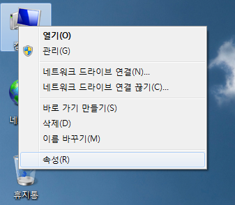  


제어판의 좌측에서 고급 시스템 설정을 클릭합니다.  
<그림> 고급 시스템 설정  
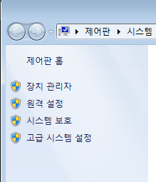  

하단의 시스템 변수에서 Path 항목을 선택합니다. 여기에 들어갈 값은 빌게이츠 친구 탐색기에서 복사할 수 있습니다.  
<그림> 시스템 변수 Path  
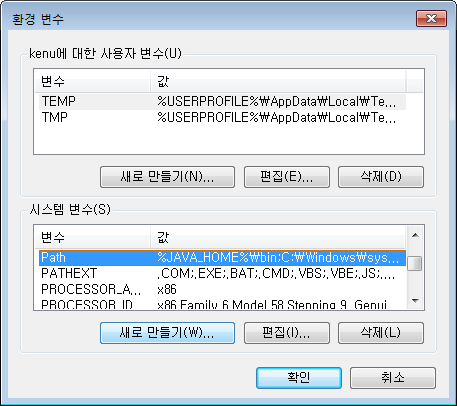  

탐색기를 열어서 C:\eGovFrameSvr\maven\bin 폴더에 들어갑니다. 주소줄을 클릭해서 복사합니다.  
<그림> 메이븐 경로 복사  
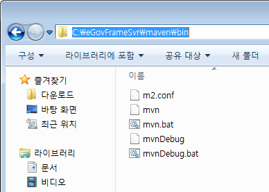  

시스템 환경 변수 Path의 제일 앞에 복사한 C:\eGovFrameSvr\maven\bin 경로를 추가하고 ;을 붙여서 구분해 줍니다.  
<그림> 메이븐 경로 Path에 추가  
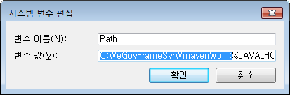  

cmd 창을 띄워서 mvn --version 을 입력합니다. 버전이 표시되면 정상적으로 설치가 된 것입니다.  
<그림> 메이븐 버전 확인  
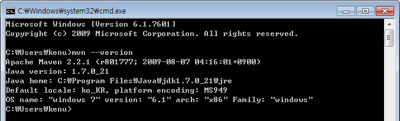  

#### 메이븐 간단 테스트

간단히 템플릿 코드를 생성해 보겠습니다. 다음의 코드를 cmd창에 입력합니다.  
```
mvn archetype:generate -DgroupId=com.mycompany.app -DartifactId=my-app -DarchetypeArtifactId=maven-archetype-quickstart -DinteractiveMode=false
```

필요한 jar파일을 알아서 다운로드합니다. 그 파일들을 이용해서 archetype 플러그인의 generate 골을 실행합니다.    
<그림> 메이븐 아키타입 실행  
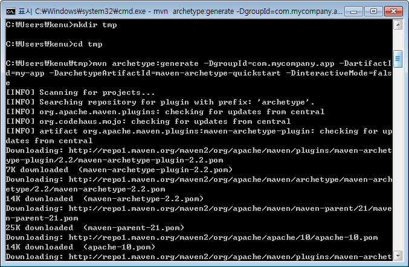  

tree /f 도스 명령어를 이용해서 생성된 파일들과 폴더를 보면 다음과 같습니다.  src/main, src/test 폴더에 각각 지정한 groupId 패키지에 따른 하위 폴더와 각각의 java 샘플이 있고, 가장 상위에는 pom.xml 파일이 있습니다.  
<그림> 메이븐 아키타입 퀵스타트 구조  
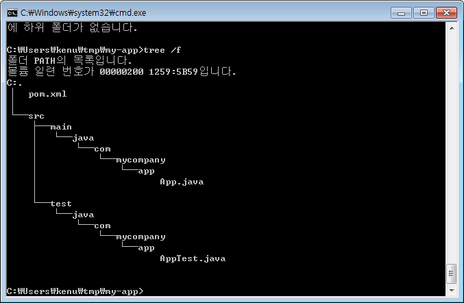  

빌드는 mvn package 페이즈(phase)를 통해서 할 수 있습니다.  
<그림> 메이븐 pacakge 페이즈 실행  
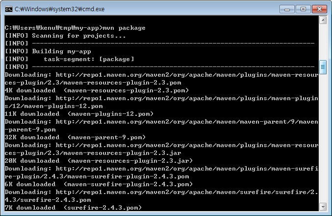  

결과는 target 폴더가 만들어지면서 담기게 됩니다. quickstart 샘플의 경우 jar파일이 만들어 집니다.  
<그림> 메이븐 산출물 target  
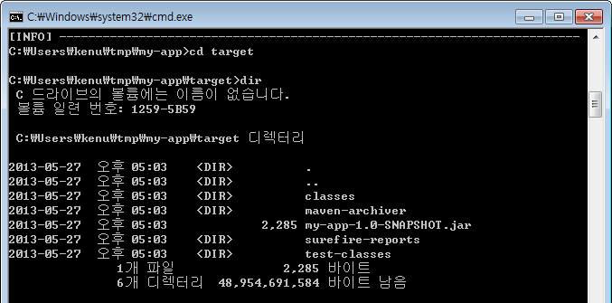  

target 폴더로 이동해서 java -cp my-app-1.0.SNAPSHOT.jar com.mycompany.app.App 명령을 입력하면 실행할 수 있습니다.  
<그림> 메이븐 결과 실행  
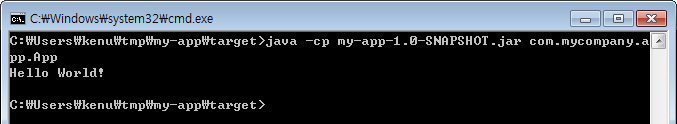  

간단히 메이븐을 설치하고 이용하는 방법을 알아보았습니다.  


## 개발환경 서버

개발팀이 함께 개발을 하기 위해서 서브버전과 같은 소스 코드 저장소가 필요합니다. 서브버전을 중심으로 허드슨, 넥서스와 같이 개발 상황을 확인하고, 도와주는 제품들이 개발환경 서버에 패키징되어 있습니다. 이 장에서는 개발환경 서버의 주요 기능들을 서브버전, 허드슨, 넥서스 순서로 살펴보겠습니다.  

### 서브버전, 소스 버전 관리 도구
서브버전은 프로젝트 소스를 저장하고 공유할 수 있는 버전관리시스템입니다. 앞서 개발환경 서버를 설치하고 JAVA_HOME을 환경변수에 추가했습니다. 서브버전과 톰캣을 윈도우 서비스에 등록합니다. 이클립스의 서브버전 플러그인을 통해서 연결하는 방법을 알아보겠습니다.

#### 서브버전 설치 및 확인
개발환경 서버에서 서브버전은 bin폴더 안에 관련 파일들이 있습니다.  
<그림> 서브버전 실행 파일  
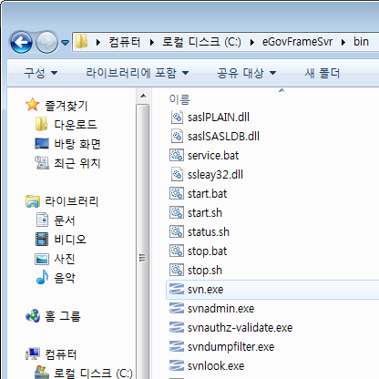  
 

#### 서브버전 서비스 실행  
윈도우 서비스에 등록하는 start.bat 파일을 실행합니다.   
<그림> 서브버전 서비스 등록  
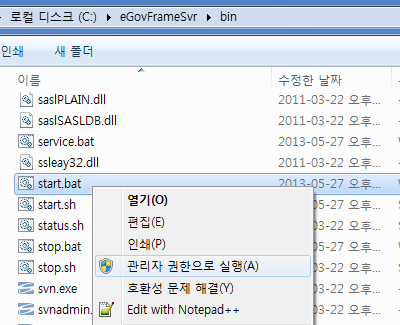  

윈도우7일 경우 관리자 권한으로 실행해야 정상동작합니다. svnserve와 tomcat이 함께 서비스에 등록되고 실행됩니다. 
<그림> 서브버전 서비스 실행  
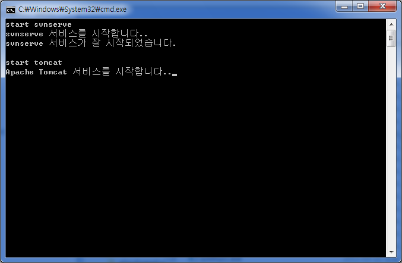  

탐색기에서 컴퓨터를 선택하고 컨텍스트 메뉴에서 관리를 선택하면 서비스 항목을 보실 수 있습니다.  
<그림> 서브버전 서비스 실행 확인  
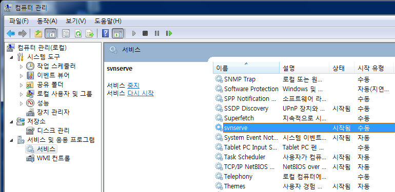  

 	    
#### 서브버전 설정  
repository/conf 폴더에는 세 개의 파일이 있습니다. 그림과 같이 authz, passwd, svnserve.conf 파일입니다.  
<그림> 서브버전 설정  
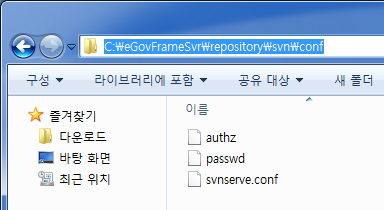  

이 중에서 passwd 파일을 열어보면 다음과 같이 계정과 비밀번호가 기록되어 있습니다.  
<그림> 서브버전 계정 정보  
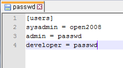  

#### 이클립스와 서브버전 연결  
표준프레임워크에는 서브버전 클라이언트로 서브버시브(Subversive) 플러그인이 포함되어 있습니다. 서브버시브 퍼스펙티브로 전환하기 위해서 Ctrl+3으로 퀵 액세스 창에서 svn을 입력합니다.  
<그림> 서브버시브 플러그인  
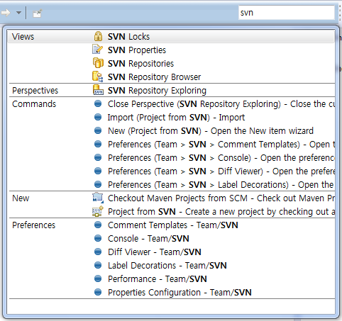  

Perspectives 영역의 "SVN Repository Exploring" 아이콘을 확인합니다.  
<그림> 서브버시브 퍼스펙티브  
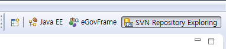  

좌측의 SVN Repositories 뷰의 "New Repository Location" 아이콘을 클릭합니다.  
<그림> 서브버전 탐색기  
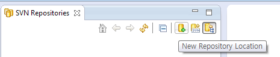  

나타나는 창에 다음과 같이 입력합니다. URL은 svn://localhost/svn 을 입력하고 Browse… 버튼을 눌러서 서브버전에 접속되는지 확인합니다. User에는 developer Password에는 passwd 라고 입력하고 Finish 버튼을 클릭합니다.  
<그림> 서브버전 서버 연결 정보  
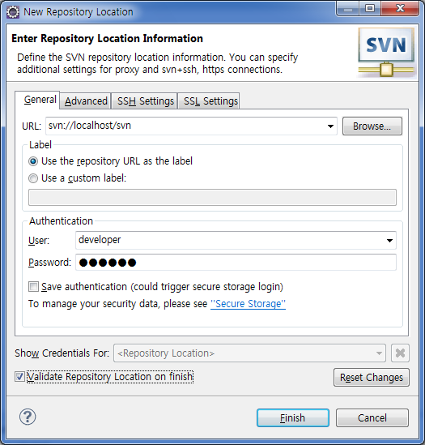  

SVN 저장소를 볼 수 있는 뷰에 그림과 같이 trunk, branches, tags 가 보일 것입니다. 정상적으로 연결이 되었다면 이제 소스를 등록할 차례입니다.  
<그림> 서브버시브 퍼스펙티브  
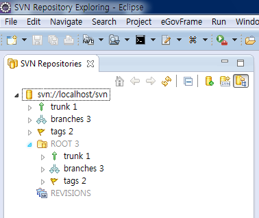  

```
서브버전의 주소 svn://localhost/svn 에서 사용하는 기본 포트는 3690 입니다.
```

#### 프로젝트 등록  

등록하려는 프로젝트를 eGovFrame 퍼스펙티브의 Package Explorer 뷰에서 선택합니다. 그림과 같이 컨텍스트 메뉴에서 Team > Share Project... 항목을 선택합니다.  
<그림> 프로젝트 공유  
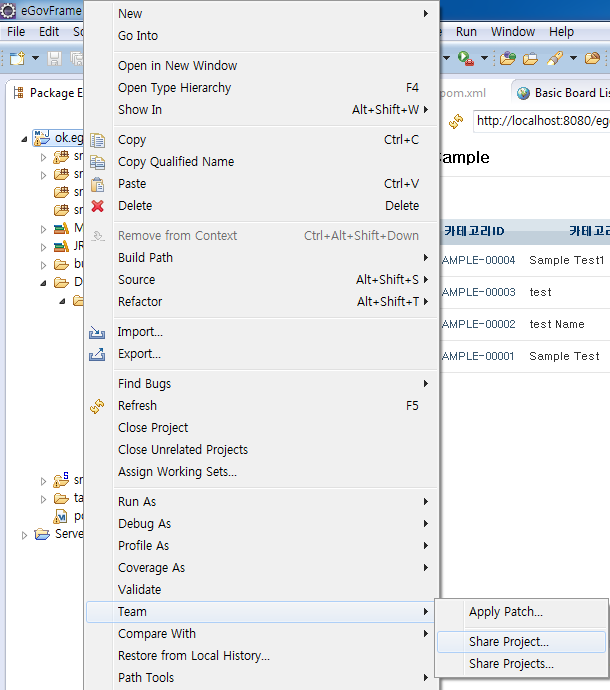  

CVS, Git, SVN에서 SVN을 선택합니다.  
<그림> SVN 선택  
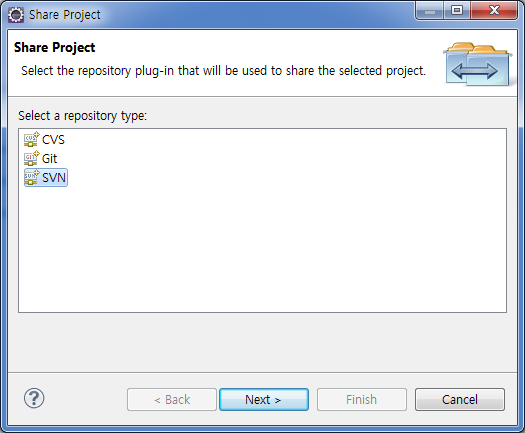  

SVN 저장소 연결정보를 확인합니다. URL 항목에 svn://localhost/svn 그리고 User / Password 에는 developer / passwd 가 있는지 확인합니다.
<그림> 저장소 연결 정보 확인  
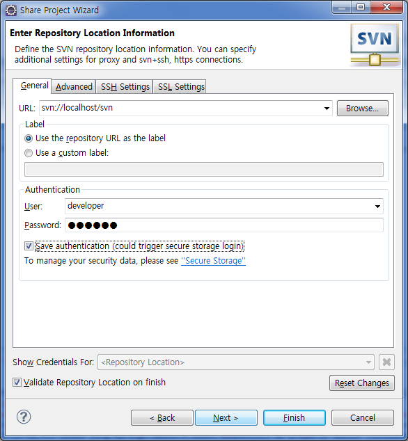  

URL 주소 옆의 Browse... 버튼을 클릭했을 때 만약 그림과 같이 서버 저장소에 접근할 수 없다면 <An error occurred while accessing the repository entry > 메시지를 만나게 됩니다. 이런 경우 서브버전 서비스가 제대로 동작하고 있는지, 입력 주소가 정확한지 확인해 보아야 합니다.  
<그림> 연결 오류  
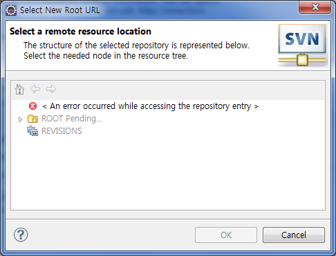  

정상적으로 접근했다면 branches, tags, trunk 폴더를 확인할 수 있습니다. ROOT 선택창을 Cancel 버튼을 클릭해서 닫고, Next 버튼을 클릭해서 다음으로 넘어 갑니다.  
<그림> 정상 연결  
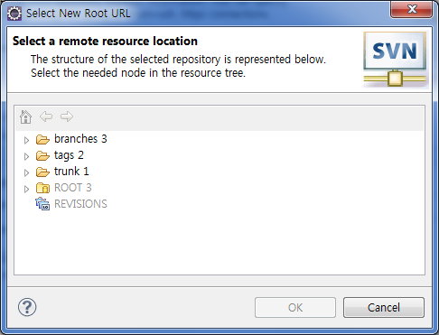  

일반적으로 프로젝트를 trunk 아래에 놓고 버전을 관리하게 됩니다. Simple Mode 아래 있는 Advenced Mode 를 선택합니다. 제일 아래 svn://localhost/svn/trunk/ok.egov 주소를 확인합니다. 이 프로젝트의 svn주소가 됩니다.  
<그림> SVN Advenced Mode  
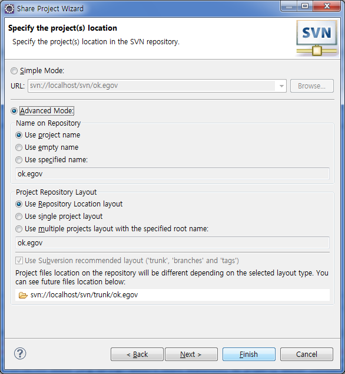  

프로젝트가 SVN 저장소에 자리를 잡기 위해서 제일 먼저 커밋(Commit)이 됩니다. Finish 버튼을 클릭하면 Share project "ok.egov" into "svn://localhost/svn" 코멘트로 커밋이 됩니다.  
<그림> 프로젝트 커밋  
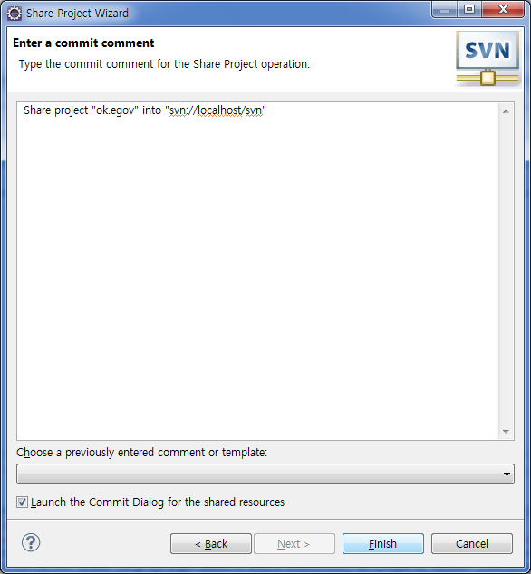  

이어서 소스를 커밋하기 위한 창이 뜹니다. 하단의 목록에서 커밋 대상이 되는 소스를 선택할 수 있습니다. 코멘트에 init라고 입력합니다. 버전 관리 시스템에 커밋할 때 간단한 메시지를 입력하는 것은 나중에 이력을 조회할 때 매우 중요하기 때문에 반드시 입력해야 합니다.   
<그림> 소스 커밋  
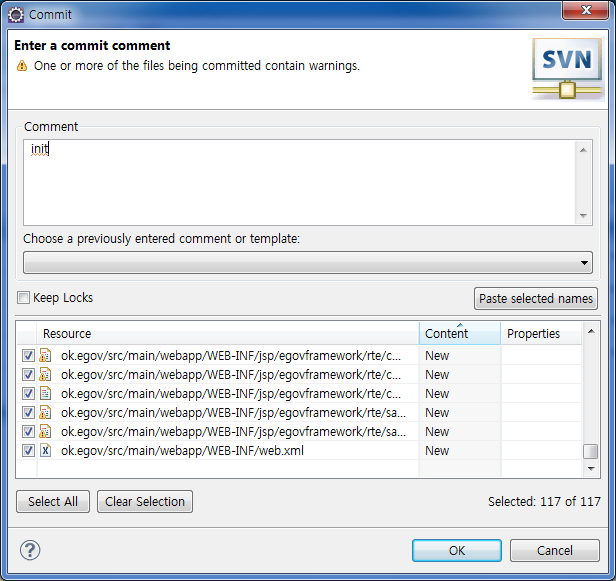  

svn연결이 완료되면 eGovFrame 퍼스펙티브의 Package Explorer 뷰에 보이는 프로젝트에 버전(리비전) 번호가 보입니다.  
<그림> SVN 연결된 프로젝트  
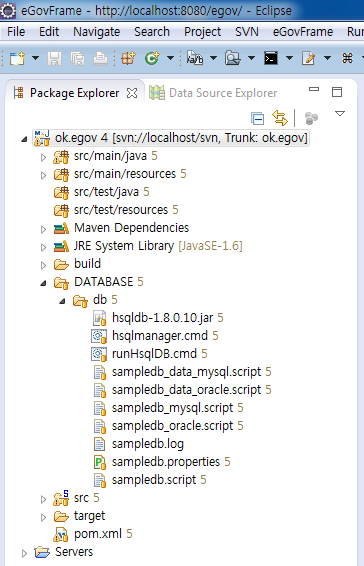  

#### 프로젝트 삭제하기  
다음 섹션에서 다룰 서브버전에 등록된 프로젝트 가져오기를 위하여 프로젝트를 삭제할 것입니다. 현재 실행중인 DB를 ctrl+C 로 정지시키고, cmd 창을 닫습니다.  
<그림> DB 정지하고 창 닫기  
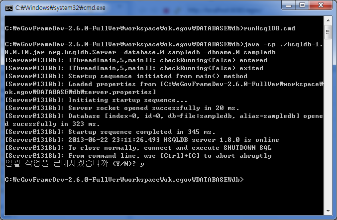  

프로젝트를 선택하고, 컨텍스트 메뉴에서 Delete(삭제)를 선택합니다. Delete project contents on disk (cannot be undone) 체크박스를 체크해야 워크스페이스 폴더 안의 모든 파일이 삭제 됩니다.  
<그림> 프로젝트 완전 삭제  
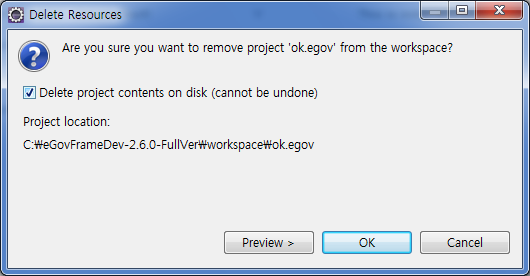  

#### 서브버전 프로젝트 가져오기  

서브버전에 등록된 프로젝트를 가져오는 방법을 설명합니다. SVN 저장소에 등록된 소스를 로컬로 가져오는 작업을 체크아웃(check out)이라고 합니다. SVN Repository Exploring 퍼스펙티브로 전환하려고 합니다. ctrl+3 으로 퀵 액세스 모드에서 svn이라고 입력하면 SVN 관련 퍼스펙티브 항목이 나타날 것입니다.  
<그림> SVN Repository Exploring 퍼스펙티브 선택  
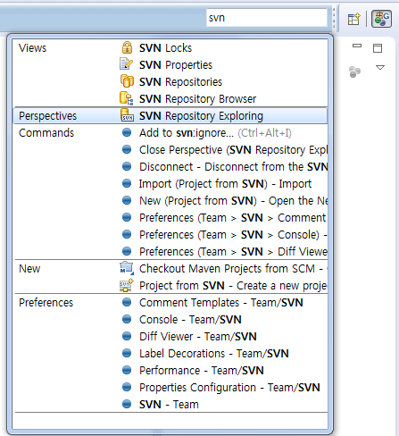  

SVN이 연결된 상태이기 때문에 연결된 주소를 볼 수 있습니다. 앞에서 등록한 ok.egov 프로젝트를 trunk 아래에서 확인합니다.  
<그림> SVN 저장소  
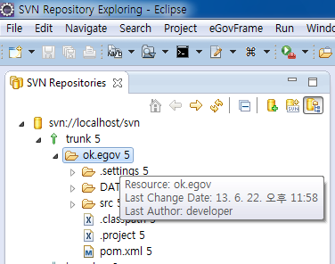  

프로젝트를 선택하고 컨텍스트 메뉴에서 Check Out(체크 아웃) 메뉴를 클릭합니다. 프로젝트 소스를 로컬의 워크스페이스 폴더로 복사하고, 프로젝트를 가져옵니다.  
<그림> 프로젝트 체크 아웃  
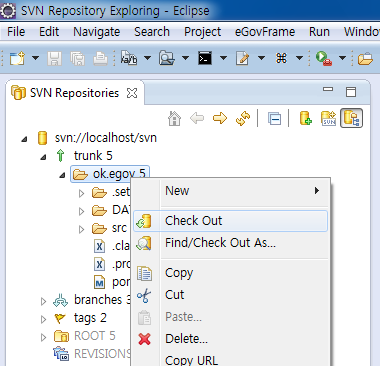  

가져오기가 끝나면 우측 상단의 퍼스펙티브 셀렉터에서 eGovFrame 아이콘을 클릭해서 퍼스펙티브를 변경합니다.
<그림> 퍼스펙티브 셀렉터  
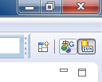  

가져온 프로젝트는 대체로 빌드 경로 등의 이슈가 있기 마련입니다. 만약 그림과 같이 오류가 있다면 우선 Problems 뷰나 Markers 뷰에서 오류를 확인합니다. 오류에 대해 조치를 취했다면 다시 빌드합니다.  
<그림> 오류가 있는 프로젝트  
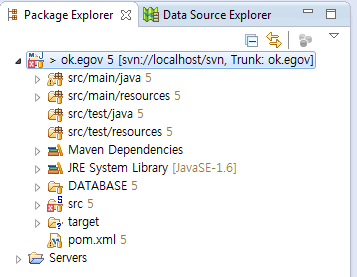  

빌드를 다시 하려면 메뉴의 Project > Clean... 항목을 선택합니다. 클래스를 다 지우고, 다시 컴파일하는 메뉴입니다.   
<그림> 프로젝트 클린  
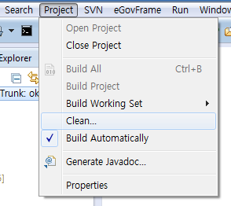  

워크스페이스 전체를 다시 클린할 수도 있고, 선택한 프로젝트만 클린하고 다시 빌드할 수 있습니다.  
<그림> 클린할 프로젝트 선택  
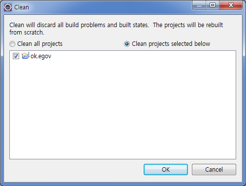  

프로젝트가 정상적으로 빌드되면 빨간 색 표시가 사라질 것입니다.

#### 서브버전 예외 폴더  

프로젝트에서 target폴더는 버전관리에서 제외할 폴더입니다. target은 메이븐에서 만드는 폴더이고, 컴파일한 클래스와 jar, war 파일처럼 산출물이 만들어지는 폴더입니다. 이러한 폴더는 소스만 있으면 언제든지 재생할 수 있고, 용량이 크기 때문에 버전관리에서 제외합니다. 제외하는 방법은 다음과 같습니다. 

물음표(?)가 붙은 target 폴더를 선택합니다. 컨텍스트 메뉴에서 Team > Add to svn:ignore... 항목을 클릭합니다.  
<그림> svn:ignore  
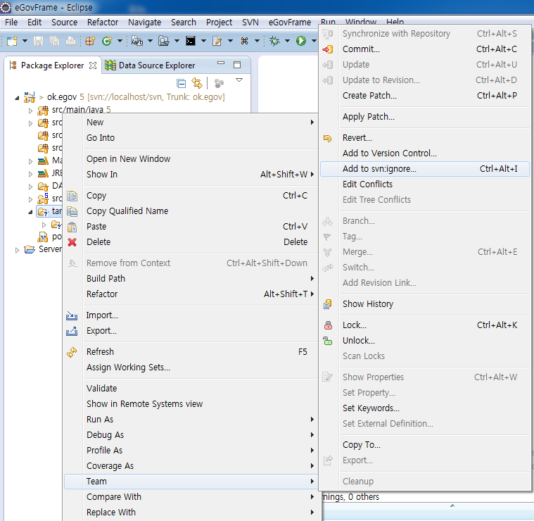  

target 폴더를 버전관리하지 않도록 svn:ignore에 추가를 확인하는 창이 뜹니다.  
<그림> target 폴더 제외  
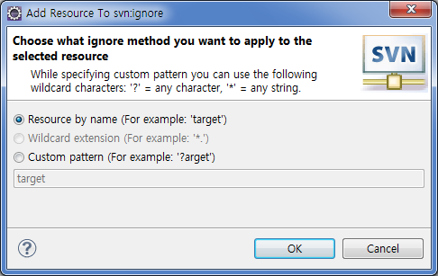  

프로젝트 명 앞의 부등호 기호(>)는 해당 프로젝트에 변경이 일어났다는 것을 뜻합니다. 
환경적인 변화도 커밋의 대상이 됩니다. 프로젝트를 선택하고 Team > 
Synchronize with Repository 항목을 클릭합니다.  
<그림> 저장소 동기화 퍼스펙티브  
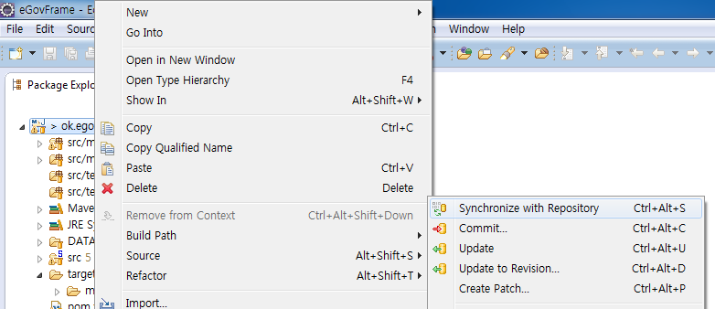  

마찬가지로 커밋 창에는 ignore target 이라는 코멘트를 답니다. 물론 한글로 코멘트를 
달아도 됩니다.  
<그림> 커밋 코멘트  
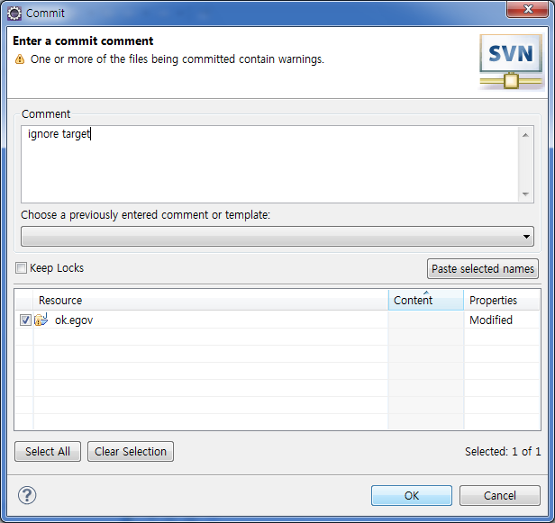  

지금까지 간단히 서브버전을 설치하고, 실행하고, 연결하고, 프로젝트를 등록하고, 프로젝트를 
체크 아웃하는 방법을 알아보았습니다. 소스를 서브버전에 커밋해서 등록한 경우 이것을 
자동으로 빌드해서 검증하거나 배포하는 도구와 연결할 수 있습니다. 다음 장에서는 허드슨이라고 
불리는 지속적인 통합(Continuous Integration) 도구를 이용해 보겠습니다.  


### 허드슨, 지속적인 통합 도구  

프로젝트를 진행할 때 업무 단위별로 팀을 나눠서 개발을 하고 난 뒤 오픈 한 달 전부터 코드를 
통합하는 작업을 따로 했던 시기가 있었습니다. 이때 팀 간의 인터페이스가 맞지 않아서 이를 
수정해서 맞추는 작업에 굉장히 많은 노력과 시간이 들었습니다.  
전체 프로젝트 팀의 소스를 매일 매일 합쳐서 큰 문제가 생기기 전에 매일매일 소스를 빌드하는 
방법이 가능해졌습니다. CVS, SVN과 같은 버전관리 시스템을 적용하고, 이 장에서 설명할 
허드슨과 같은 지속적인 통합(Continuous Integration) 도구를 사용하면 손쉽게 프로젝트를 
관리할 수 있습니다.  

허드슨은 http://hudson-ci.org 사이트에서 정보를 얻을 수 있습니다. 오픈소스로 태어났지만 
썬을 인수한 오라클과의 운영 이슈로 허드슨의 원 개발자가 자바닷넷(http://java.net)을 떠나 
깃허브(https://github.com/jenkins)로 자리를 옮겨서 동일한 제품을 만들었습니다. 젠킨스(Jenkins)이며 http://jenkins-ci.org 사이트를 통해서 공개되고 있습니다. 두 제품의 
사용법은 동일합니다.

표준프레임워크 개발환경 서버를 설치하면 톰캣이 설치됩니다. 톰캣의 webapps/ 폴더에 
hudson.war 파일이 위치합니다. 톰캣이 실행되면 자동으로 압축이 풀리면서 hudson 사이트가
준비됩니다.

<그림> hudson.war 파일 위치  
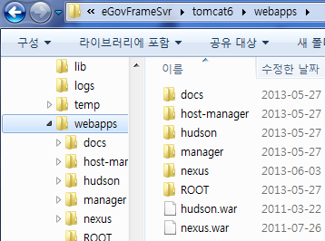  

윈도우7에서는 서비스에 등록된 톰캣을 일반 cmd창에서 실행할 수 없습니다. 권한이 없기 때문이죠. 
cmd창을 관리자 모드로 실행하고, net start tomcat6 명령으로 실행할 수 있습니다. 만약 
실행중이라면 "요청한 서비스가 이미 시작되었습니다."라는 메시지를 보게 될 것입니다.

<그림> 관리자 모드 톰캣 서비스 시작  
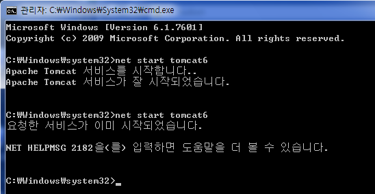  

브라우저를 통해서 http://localhost:7070 페이지로 접속하면 자동을 /hudson 컨텍스트로 
이동합니다. 허드슨이 준비가 완료된 화면입니다. 왼쪽 메뉴에서 새 작업을 클릭합니다.  

<그림> 허드슨 페이지 접속  
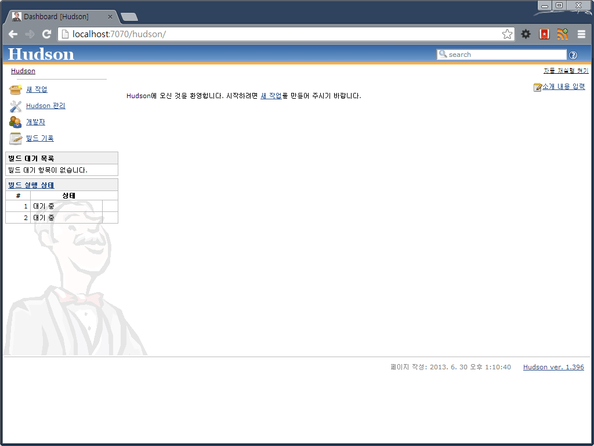  

새 작업 화면에서는 프로젝트명과 스타일을 정합니다. ok.egov 라고 프로젝트명을 입력합니다. 
작업 스타일은 메이븐을 사용하기 때문에, 두 번째 항목인 Build a maven2/3 project 를 
선택합니다. ok 버튼을 클릭하면 메이븐 기반의 프로젝트를 다루는 작업이 만들어집니다.     

<그림> 허드슨 새 작업 만들기  
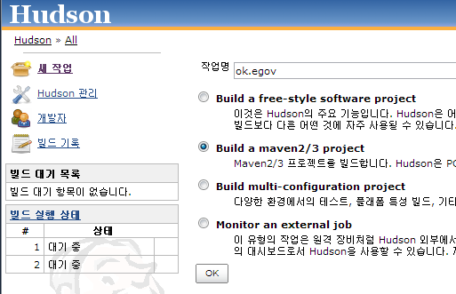  

바로 설정(Configure) 화면이 나타납니다. 많은 설정 항목이 있지만 처음이기 때문에 간단히 핵심적인 것만 
설정하겠습니다. 소스 프로젝트가 담겨 있는 서브버전과 연결이 시작입니다. 
Source Code Configuration 섹션의 Subversion을 선택합니다. 서브버전의 주소에 
프로젝트 경로까지 추가합니다. svn://localhost/svn/trunk/ok.egov 주소를 입력합니다.  

<그림> 허드슨 작업 설정  
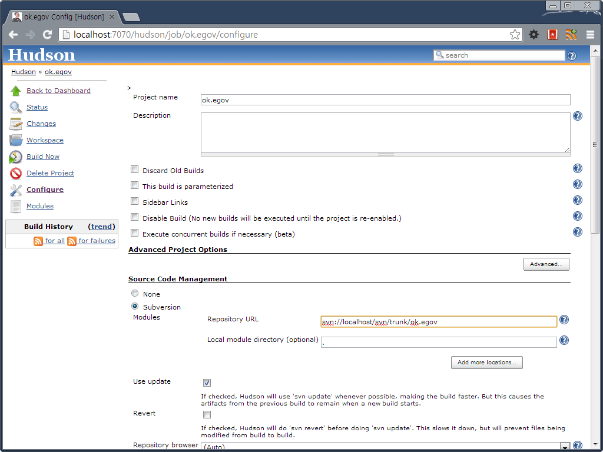  

허드슨 설정 페이지의 제일 하단에 있는 Save 버튼을 클릭하면 저장됩니다. 

<그림> 허드슨 작업 설정 저장  
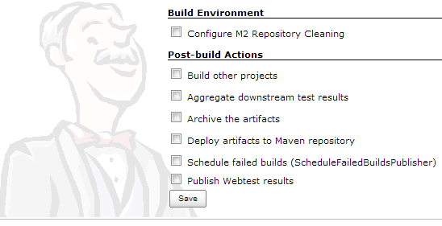  

프로젝트 페이지에서는 프로젝트의 전체적인 현황이 보입니다. 좌측에 있는 메뉴들을 통해서 설정을 변경하거나 
빌드하거나 프로젝트 소스를 조회하거나, 변경 이력 등을 살펴 볼 수 있습니다.

<그림> 허드슨 프로젝트 페이지  
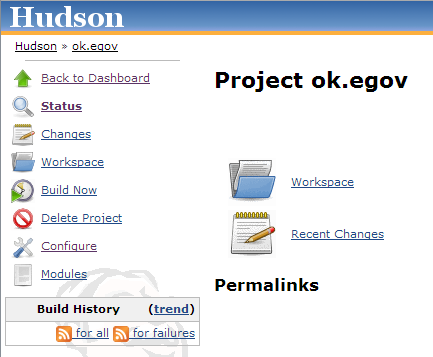  

좌측 메뉴에서 Build Now를 클릭하면 잠시 후 왼쪽 하단에 빌드가 시작되는 것을 볼 수 있습니다. 
해당 링크를 클릭해서 현재 빌드의 진행 상황을 웹 브라우저에서 확인할 수 있습니다.   

<그림> 허드슨 프로젝트 빌드  
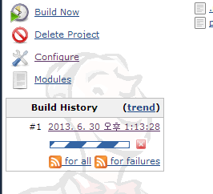  

특정 번호의 필드로 들어가면 상단의 네비게이션 줄에 Hudson >> ok.egov >> #1 과 같이 표시됩니다. 
좌측 메뉴에서 콘솔출력 메뉴를 클릭하면 빌드 로그를 확인할 수 있습니다.  

<그림> 허드슨 프로젝트 빌드 콘솔 출력  
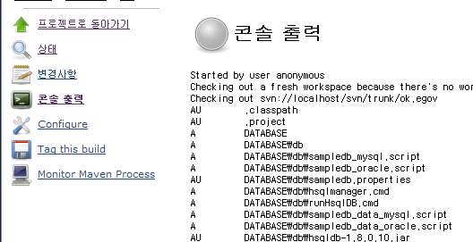  

eGovFrameSvr 서버 2.0.0에는 jdk1.5가 포함되어 있고, hudson의 세팅은 여기에 맞춰져 있습니다. 그래서 jdk1.6이상으로 맞춰진 프로젝트는 컴파일 되지 않는 이슈가 있습니다.

<그림> 허드슨 프로젝트 빌드 오류  
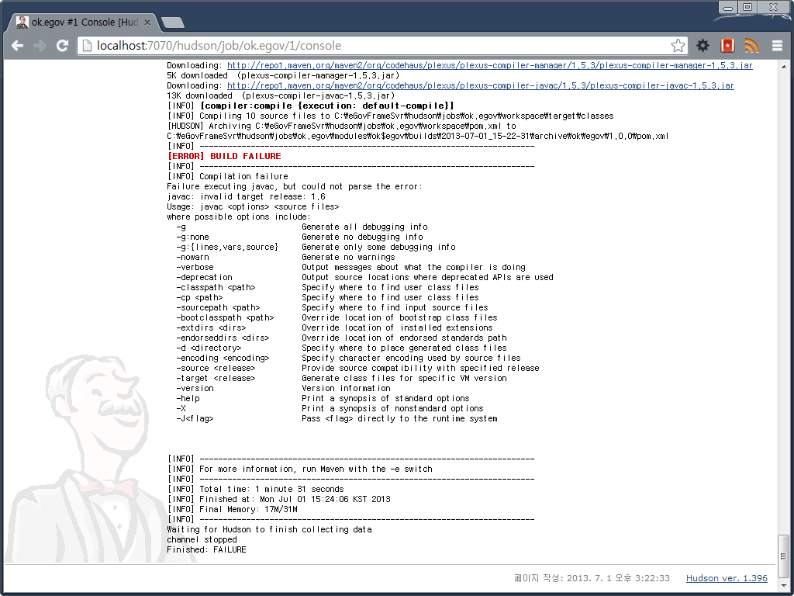  


이를 해결하려면 허드슨 관리에서 JDK의 버전을 1.6 이상으로 맞춰 줘야 합니다. 메인 페이지에서 Hudson 관리 > Configure System > JDK 섹션으로 이동합니다.

<그림> 허드슨 관리 JDK 설정  
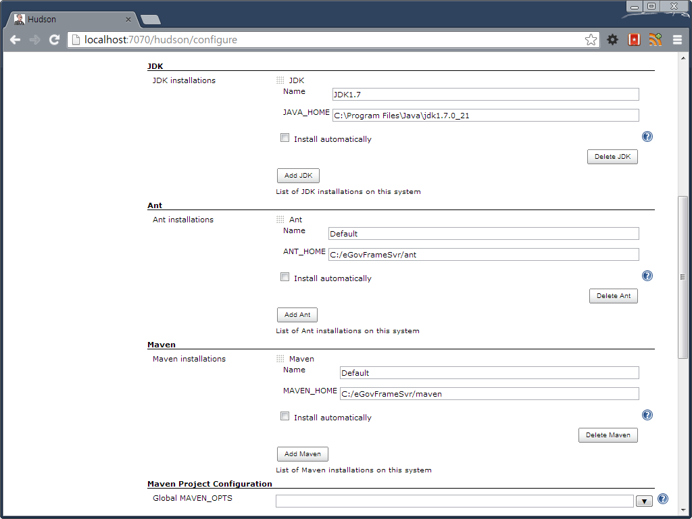  

수정 후에는 정상적으로 빌드될 것입니다.

<그림> 허드슨 프로젝트 빌드 성공  
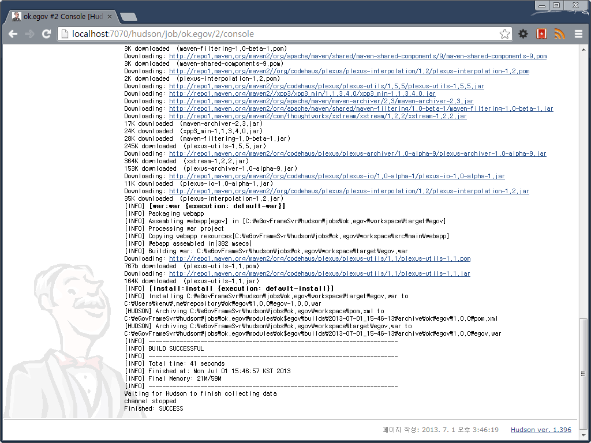  

#### 주기적인 빌드

허드슨은 지속적인 통합(CI;Continuous Integration) 도구입니다. 지속적인 통합이란 XP(eXetreme Programming) 방법론에서 
얘기되는 XP 습관(Practices) 중의 하나입니다.

<그림> XP 습관  
from: [http://xprogramming.com/book/whatisxp/](http://xprogramming.com/book/whatisxp/)  
  

지속적인 통합에 대한 마틴 파울러의 글은 많이 인용되고 있는 명문입니다. 
<그림> 마틴 파울러 지속적인 통합  
from: [http://xprogramming.com/book/whatisxp/](http://xprogramming.com/book/whatisxp/)  
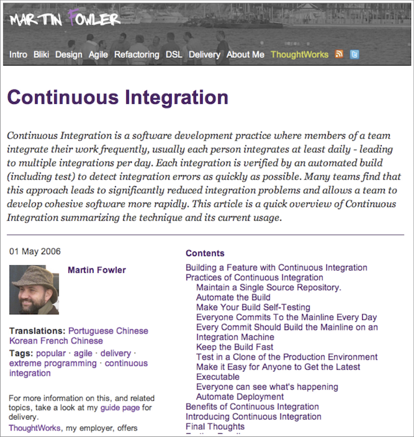  

주기적인 작업을 하기 위해서 유닉스/리눅스에서는 crontab 명령을 사용합니다. 같은 포맷으로 허드슨에서 
프로젝트 빌드를 실행하도록 지정할 수 있습니다. 프로젝트 Configure 메뉴에서 Build Triggers 섹션의 
Build periodically 항목을 체크합니다. 분 시 일 월 요일 다섯가지 항목을 정합니다. 우측의 ? 아이콘을
클릭하면 자세한 설명이 영어로 나옵니다.  

예를 들어 0 * * * * 이라고 설정하면 매시 정각에 빌드를 실행합니다. 0 3 * * 0 이런 경우는 일요일 03:00 에만 빌드가 실행됩니다.   

<그림> 허드슨 프로젝트 빌드 주기 설정  
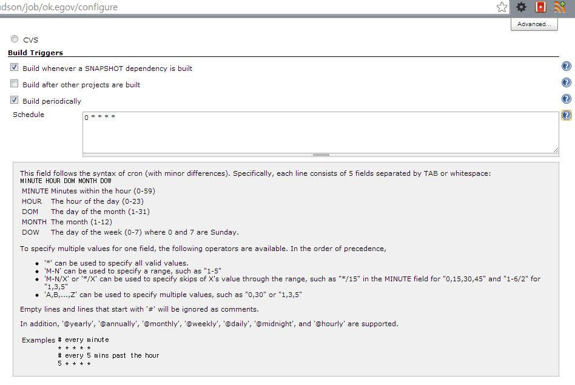  

가장 기본적인 빌드 설정에 대해서 알아보았습니다. 아주 많은 옵션과 플러그인들이 있는데, 책 후반에 유용한 것들을 소개하겠습니다.  
 
	


### 넥서스, 라이브러리 저장소  

메이븐을 통해서 라이브러리(jar)를 일괄 관리한다고 했습니다. 이것은 개인 PC의 ~/.m2/repository 와 
프로젝트 빌드의 관계에 해당됩니다. 새로운 라이브러리는 인터넷을 통해서 가져오는데, 이것을 효과적으로 관리하는
중계 저장소를 팀 안에 구축할 수 있습니다.  

앞에서 hudson.war 파일을 소개했는데, 같은 폴더에 nexus.war 파일이 있습니다. 

<그림> nexus.war 파일 위치  
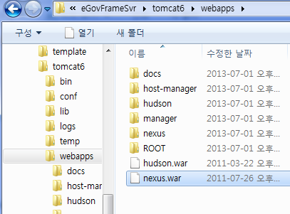  

허드슨과 마찬가지로 개발환경 서버의 톰캣이 실행되면 자동으로 압축이 풀리면서 
http://localhost:7070/nexus 로 접근할 수 있습니다.

<그림> 넥서스 페이지 접속  
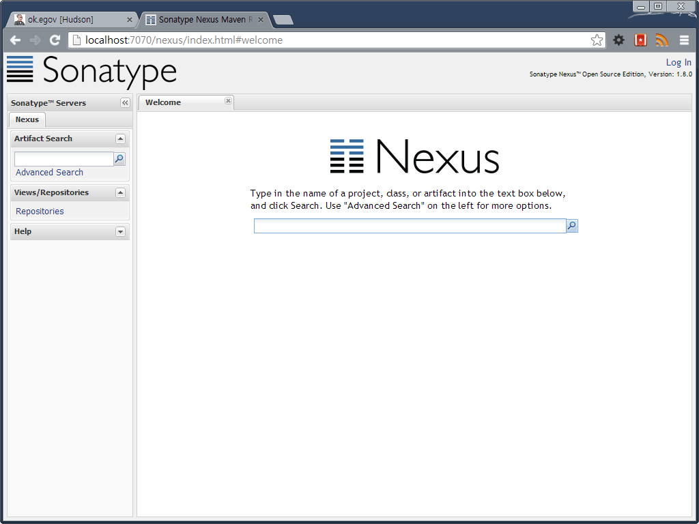  

화면 우측 상단의 Log in 링크를 누르면 로그인 창이 뜹니다. admin / admin123 으로 처음 로그인 할 
수 있습니다.

<그림> 넥서스 관리자 접속  
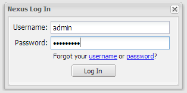  

#### 넥서스 비밀번호 변경  
넥서스의 관리자 비밀번호는 로그인 후 좌측 메뉴에서 Security > Change Password 항목을 선택하면 
됩니다. 현재 비밀번호를 Current Password 항목에 입력하고, 새로운 비밀번호와 그 비밀번호를 
확인하기 위해 다시 입력해서 변경을 완료합니다.

<그림> 넥서스 관리자 비밀번호 변경  
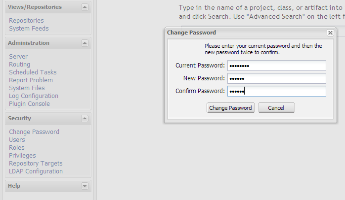  

#### 넥서스 연결을 위한 설정  

메이븐이 참조하는 설정은 C:\eGovFrameSvr\maven\conf\settings.xml 을 참고합니다. 
표준프레임워크는 settings.xml 에서 라이브러리 저장소의 경로를 C:\eGovFrameSvr\m2\repository 로 
정해놓았습니다. 

settings.xml의 내용은 다음과 같습니다. 주석을 모두 제거하면 localRepository에 설정된 것이 보일 것입니다.  

```
<?xml version="1.0" encoding="UTF-8"?>
<settings xmlns="http://maven.apache.org/SETTINGS/1.0.0"
          xmlns:xsi="http://www.w3.org/2001/XMLSchema-instance"
          xsi:schemaLocation="http://maven.apache.org/SETTINGS/1.0.0 http://maven.apache.org/xsd/settings-1.0.0.xsd">
  <localRepository>C:/eGovFrameSvr/m2/repository</localRepository>
  <pluginGroups>
  </pluginGroups>
  <proxies>
  </proxies>
  <servers>
  </servers>
  <mirrors>
  </mirrors>
  <profiles>
  </profiles>
</settings>

```

<mirrors> 태그에 다음과 같이 코드를 추가하면 됩니다. 192.168.0.8 아이피는 넥서스가 설치된 서버의 주소입니다.  

```
  <mirrors>
    <mirror>
      <id>nexus</id>
      <mirrorOf>*</mirrorOf>
      <url>http://192.168.0.8:7070/nexus/content/groups/public</url>
    </mirror>
  </mirrors>
```

이렇게 설정이 되면 메이븐이 바라보는 서버가 인터넷이 아닌 넥서스로 설정이 됩니다.  

### 라이브러리 등록하기  
넥서스에 라이브러리를 등록하는 과정을 설명하겠습니다. 개별 파일을 등록하는 방법과 저장소 전체를 복사하는 방법을 알아보겠습니다.  

#### 커스텀 저장소 만들기  

#### 커스텀 저장소 그룹에 추가하기  

#### 개별 라이브러리 추가하기  

#### 라이브러리 일괄 추가하기  


## 개발환경 도구

표준프레임워크의 개발환경은 이클립스를 기준으로 구성되어 있습니다. 통합개발환경(IDE; Integrated Development Environment)이라고 불리는 이클립스는 메모장, 울트라에디터, 에디트플러스 같은 텍스트편집기보다 메모리와 시스템 자원을 더 많이 사용합니다. 편집 기능을 비롯해서 프로젝트를 편하게 관리할 수 있는 여러 기능을 지원하기 때문입니다.  

스프링 프레임워크와 같이 관련된 수많은 코드 사이를 자유롭게 이동할 수 있는 기능과 디버깅 그리고 막강한 편집기능을 소개합니다.

### 코드 네비게이션  

여기서 주로 다루게 되는 스프링 프레임워크의 소스 구조는 패턴이 있습니다. 다음 그림과 같은 메커니즘으로 파일이 호출이 되기 때문에 탐색기 형태로 코드를 관리하기 어렵습니다. 메커니즘에 따른 호출 순서를 보면 다음과 같습니다.

1. URL 매핑
2. 컨트롤러
3. 서비스 인터페이스
4. 서비스 구현체
5. DAO 
6. iBatis SQL
7. JSP

함께 이 순서를 따라가보겠습니다.  

#### 검색 옵션 수정
이클립스에서 ctrl+h를 입력하면 다양한 검색 옵션을 볼 수 있습니다. 
가장 많이 사용되는 것이 File Search 이기 때문에 다른 옵션의 탭들은 가려놓고, 필요에 따라 추가할 것을 권장합니다. 
검색창 우측 하단에 있는 Customize... 버튼을 클릭합니다.
Deselect All 버튼을 클릭해서 모든 선택을 해제하고, File Search 항목만 체크합니다.  
이제부터 ctrl+h 단축키를 누르면 File Search 탭만 보이게 될 것입니다. 이 검색 기능을 통해서 프로젝트에 있는 모든 파일의 문자열 검색을 쉽게 할 수 있습니다.

#### URL 매핑 찾기  
앞에서 다루었던 예제를 통해서 코드 네비게이션을 해보겠습니다. DB를 실행하고, ok.egov 프로젝트를 선택합니다. Run As Server 로 프로젝트를 실행합니다. 
첫 줄에 있는 SAMPLE-00004 링크를 클릭해서 들어가면 주소줄이 다음과 같을 것입니다.  
http://localhost:8080/egov/sample/updateSampleView.do;jsessionid=48CC82F461B0EE1024846CD0457AE858

http://localhost:8080 부분은 프로토콜과 호스트명과 포트번호 정보를 갖고 있습니다.
/egov 는 컨텍스트명입니다. 
/sample/updateSampleView.do 부분이 URL매핑에 해당하는 주소입니다.
;jsessionid=48CC82F461B0EE1024846CD0457AE858 는 세션을 구분하기 위한 정보입니다.

URL 매핑을 찾기 위해서 주소줄에 보이는 /sample/updateSampleView.do 부분을 선택해서 복사합니다. 이클립스에서 ok.egov 프로젝트를 선택합니다. ctrl+h 단축키로 File Search 창을 엽니다. 검색 범위 Scope를 selected로 지정합니다. Search 버튼을 클릭하면 하단에 Search 뷰가 나타나고 /sample/updateSampleView.do 문자열이 포함된 모든 파일 목록이 나타납니다.  

Search 뷰의 우측 상단에 있는 툴바 아이콘 중에서 하얀 역삼각형을 선택하면 보여지는 모양을 바꿀 수 있습니다. 계층적으로 보이는 것과 파일명을 우선적으로 보여주는 옵션이 있습니다.

#### 콘트롤러 찾기  
Search 뷰에서 EgovSampleController.java 파일을 더블클릭하면 편집기에 파일이 열리면서 검색된 부분이 보입니다. @RequestMapping("/sample/updateSampleView.do") 부분이 나타날 것입니다.  

```  
    @RequestMapping("/sample/updateSampleView.do")
    public String updateSampleView(
            @RequestParam("selectedId") String id ,
            @ModelAttribute("searchVO") SampleDefaultVO searchVO, Model model)
            throws Exception {
        SampleVO sampleVO = new SampleVO();
        sampleVO.setId(id);
        // 변수명은 CoC 에 따라 sampleVO
        model.addAttribute(selectSample(sampleVO, searchVO));
        return "/sample/egovSampleRegister";
    }		
```  

컨트롤러에서 주의깊게 봐야할 부분은 서비스 호출입니다. 당장 보이는 부분은 없는데, selectSample()이 포함된 다음 라인으로 이동합니다.  

```
        model.addAttribute(selectSample(sampleVO, searchVO));
```

selectSample()이 선언된 위치로 가기 위해서 selectSample 을 클릭하고, F3 키를 누릅니다. 커서는 selectSample() 메소스 선언부로 이동합니다. 메소드에 @RequestMapping 어노테이션이 있는 것을 보니 /sample/selectSample.do 로 호출되었을 때 실행되는 메소드를 재활용하고 있습니다.   

```
    @RequestMapping("/sample/selectSample.do")
    public @ModelAttribute("sampleVO")
    SampleVO selectSample(
            SampleVO sampleVO,
            @ModelAttribute("searchVO") SampleDefaultVO searchVO) throws Exception {
        return sampleService.selectSample(sampleVO);
    }
```

#### 서비스 찾기  
컨트롤러에서 서비스를 찾아서 이동하는 것도 Open Declaration(F3) 기능을 이용합니다.  

```
        return sampleService.selectSample(sampleVO);
```

위에 보이는 selectSample에 커서를 이동하고, F3를 클릭합니다.

```
    SampleVO selectSample(SampleVO vo) throws Exception;
```
메소드 시그니처(Signature; 서명)만 있는 EgovSampleService.java 인터페이스 파일이 열립니다. 여기에서 selectSample에 커서를 놓아둔 뒤에 ctrl+t를 클릭합니다. 이 인터페이스를 구현한 클래스가 목록으로 보입니다. 구현 클래스 EgovSampleServiceImpl 항목을 클릭하면 파일이 열리면서 해당 메소드가 나타납니다.

```
    public SampleVO selectSample(SampleVO vo) throws Exception {
        SampleVO resultVO = sampleDAO.selectSample(vo);
        if (resultVO == null)
            throw processException("info.nodata.msg");
        return resultVO;
    }
```

#### DAO 찾기
서비스에서 찾아보아야 할 것은 DAO입니다. DAO는 Data Access Object(데이터 접근 객체)를 의미하고, MyBatis 또는 iBatis 프레임워크를 이용하는 경우가 많습니다. 국내에서는 흔치 않지만 Hibername 또는 JPA(Java Persitence API)로 데이터를 다루는 경우도 있습니다. 

```
        SampleVO resultVO = sampleDAO.selectSample(vo);
```
위 라인에서 selectDAO가 DAO 인스턴스 변수입니다. selectSample 위치에 커서를 놓아두고, F3 키를 누르면 DAO 파일이 열립니다.

```
    public SampleVO selectSample(SampleVO vo) throws Exception {
        return (SampleVO) selectByPk("sampleDAO.selectSample_S", vo);
    }
```

SampleDAO.java 파일이 열리면서 selectSample() 메소드의 선언부가 나타납니다. selectByPk 위에 마우스를 올려보면 선언된 파일이 보일 것입니다. EgovAbstractDAO를 상속받은 것이 SampleDAO입니다. EgovAbstractDAO는 내부적으로 iBatis를 이용하고 있습니다. SQL Map에 저장된 SQL을 불러오기 위해서 키가 필요한데, 바로 이 키가 "sampleDAO.selectSample_S" 문자열입니다. 따옴표를 포함해서 "sampleDAO.selectSample_S" 부분을 선택하고 복사합니다.

ok.egov 프로젝트를 다시 선택하고, 검색어에 "sampleDAO.selectSample_S"을 붙여 넣습니다. 프로젝트를 검색하면 xml 파일이 Search뷰에 보일 것입니다. EgovSample_Sample_SQL.xml 파일을 더블클릭하면 편집기 영역에 열립니다. 에디터 하단의 파일명이 있는 탭을 클릭하면 소스가 보입니다. 편집기 우측 선에 작은 점으로 된 링크가 보이는데, 클릭하면 검색된 라인으로 이동합니다.  

```
	<select id="sampleDAO.selectSample_S" resultMap="sample">
		<![CDATA[
			SELECT
				ID, NAME, DESCRIPTION, USE_YN, REG_USER
			FROM SAMPLE 
			WHERE ID=#id#
		]]>
	</select>
```

#### JSP 찾기
위와 같은 단계로 URL 매핑을 통해서 컨트롤러로 그리고 서비스를 거쳐 DAO와 SQL까지 찾아 들어왔습니다. 이클립스 상단 툴바의 우측에 있는 노란 왼쪽방향 화살표를 클릭하면 이전 작업 위치로 이동합니다. 단축키는 alt+왼쪽화살표입니다. 
몇 번 누르면 콘트롤러 파일까지 갑니다. updateSampleView() 메소드로 다시 이동합니다.

```  
    @RequestMapping("/sample/updateSampleView.do")
    public String updateSampleView(
            @RequestParam("selectedId") String id ,
            @ModelAttribute("searchVO") SampleDefaultVO searchVO, Model model)
            throws Exception {
        SampleVO sampleVO = new SampleVO();
        sampleVO.setId(id);
        // 변수명은 CoC 에 따라 sampleVO
        model.addAttribute(selectSample(sampleVO, searchVO));
        return "/sample/egovSampleRegister";
    }		
```  

메소드 마지막에 있는 "/sample/egovSampleRegister" 에서 egovSampleRegister 를 선택합니다. ctrl+shift+R 을 클릭합니다. Open Resource 창이 열리면서 검색어에 선택한 텍스트가 입력되어 검색된 결과가 나옵니다. egovSampleRegister.jsp 파일을 더블클릭합니다.

컨트롤러에서 model에 담긴 도메인 모델 SampleVO 값을 JSP에서 출력하게 됩니다.

```
<form:form commandName="sampleVO" name="detailForm">
...
		<tr>
			<td class="tbtd_caption">카테고리명</td>
			<td class="tbtd_content">
				<form:input path="name" maxlength="30" cssClass="txt"/>
				&nbsp;<form:errors path="name" />
			</td>
		</tr>
```

#### 코드 네비게이션 정리  
여기까지 단순히 코드의 흐름을 따라가는 방법을 알아보았습니다. 스프링 프레임워크에 대해서는 실행환경을 설명하면서 조금 더 자세히 알아보도록 하겠습니다.  
다음에는 디버깅에 대해서 소개하겠습니다. 삽질을 줄일 수 있는 좋은 개발도구의 기능입니다.


### 디버깅  
흔히 원하는 결과가 나오지 않을 때 "마가 꼈다", "버그다" 라고 합니다. 가장 원시적인 검사 방법은 코드 중간 곳곳에 System.out.println(변수); 였습니다. 이 방법은 쓸데 없는 코드를 추가하고, 로그파일의 크기를 키우고, 성능에도 영향을 줍니다. 권장하고 싶지 않은 방법이지요. 통합개발환경(IDE)를 사용한다면 디버깅 기능을 이용하는 것을 권장합니다.

#### 기본 용어
디버깅은 실행 도중 멈춰서 변수의 내용을 확인하는 기능입니다. 확인하고 싶은 지점에 브레이크 포인트를 표시하고, 한 줄씩 실행하면서 변수들의 값이 어떻게 변하는지 메모리값을 볼 수 있습니다. 디버깅 중에 함수를 만나면 그 함수 내부로 들어가서 디버깅을 계속할 수 있습니다. 이상이 없음을 확인하면 나머지 부분을 실행하고 호출한 함수로 되돌아 갈 수도 있습니다. 브레이크 포인트가 여러 개 있거나 반복문 안에 있다면 다음 브레이크 포인트를 만날 때까지 실행하는 기능도 있습니다. 만약 남은 브레이크 포인트가 없다면 실행할 수 있는 부분까지 모두 실행됩니다.
이클립스에서는 디버깅 중간에 변수의 값을 바꿔서 시뮬레이션할 수 있는 기능을 지원합니다. 또한 디버깅으로 원하는 부분을 지나쳤다면, 디버깅을 처음부터 다시 할 필요없이 현재 메소드의 첫 줄부터 다시 디버깅할 수 있는 기능도 지원합니다.

| 브레이크 포인트 | 중단점, 디버깅을 시작하는 위치 표시 |
| 스텝 오버 | 한 줄을 실행하고 다음 줄로 포커서를 이동 |
| 스텝 인투 | 현재 포커스가 있는 줄에 있는 메소드 안으로 포커스를 이동 |
| 스텝 아웃 | 현재 메소드를 모두 실행하고, 호출한 곳으로 돌아가는 기능 |
| 핫 스왑 | 소스의 수정없이 변수값을 바꿔서 실행할 수 있는 기능 |
| 드롭 투 프레임 | 현재 메소드의 첫 줄부터 다시 디버깅할 수 있는 기능 |


#### 자바 디버깅


#### JSP 디버깅


#### 크롬에서 JS 디버깅


### 편집도구  

## 실행환경

### 실행환경 개요  

### 스프링 프레임워크  

### 스프링 IoC/DI  

### 스프링 MVC  

## 실행환경 구성

### MyBatis와 데이터베이스  

### 오픈소스 프로젝트 소개

## 공통 컴포넌트  

### 공통 컴포넌트 구성  

## 모바일 표준프레임워크  
스마트폰의 등장과 생활 속에서 강력한 파급효과를 보이면서, 업무를 모바일 환경에서 적용하려는 노력이 많아지고 있습니다. 스마트폰에 있는 웹브라우저는 가장 발전이 빠른 웹킷엔진을 사용하고 있습니다. 품질이 좋은 오픈소스가 많이 활용되기 때문입니다. 

### 모바일 표준프레임워크 구성  

#### jQueryMobile 
#### viewport


----
http://okjsp.tistory.com  
http://okjsp.net  
http://github.com/kenu  
