# 전자정부 표준프레임워크

## 개요

전자정부 표준프레임워크는 국내 SI 프로젝트의 수행을 돕기 위해서 오픈소스를 패키징하고, 
국내 SI 프로젝트를 분석해서 도출해 낸 200여 가지 공통 컴포넌트 소스 템플릿을 더한 
오픈소스 프로젝트입니다.

대형 SI 회사가 아닌 중소규모의 회사에서 공공기관이나 민간 프로젝트를 수행할 때 도움이 
되도록 구성되어 있습니다. 스프링 프레임워크와 이클립스 개발도구를 통해서 개발생산성을 
높일 수 있으며, ALM(Application Lifecycle Management) 관점에서 
소스버전관리를 위해 서브버전, 지속적인 통합을 위해 허드슨, 손쉬운 빌드를 위해서 메이븐을 
이용하고 있습니다. 

### 전자정부 표준프레임워크 아키텍처

전자정부 표준프레임워크(이하 표준프레임워크)는 이클립스 개발도구 중심의 개발환경, 스프링 
프레임워크 중심의 실행환경, 서비스요청관리를 위한 관리환경, 모니터링 도구를 중심으로 한 
운영환경, 그리고 공통적으로 재사용이 가능한 기능위주로 개발한 컴포넌트의 집합인 
공통컴포넌트로 구성되어 있습니다. 2.0 버전부터는 jQueryMobile 중심의 모바일 
프레임워크가 추가되었습니다.

<그림> 표준프레임워크 구성 (2.5)  
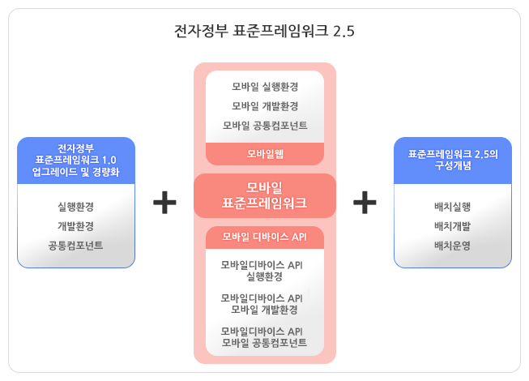

## 개발환경

실행환경 개발을 위한 개발환경을 먼저 살펴보겠습니다.

### 표준프레임워크 개발환경 다운로드

개발환경을 구성하기 위해 필요한 파일을 다운로드해야 합니다. 
[http://www.egovframe.go.kr](http://www.egovframe.go.kr) 사이트에 
접속합니다. 로그인 후에 다운로드 받을 수 있기 때문에, 먼저 회원가입을 마칩니다. 
로그인 하고, 상단 메뉴의 다운로드를 선택합니다. 개발환경 메뉴를 선택하면 다운로드할 
수 있는 목록이 보입니다.

<그림> 개발환경 다운로드 페이지  
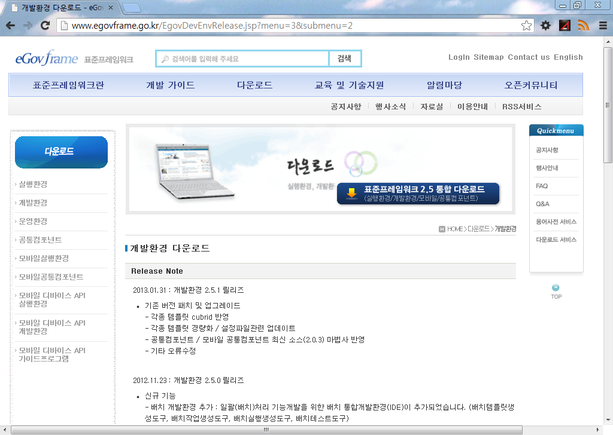

### 개발환경 2.5.1 다운로드

페이지 중간으로 내려 보면 개발환경 링크 목록이 나옵니다. 1.0.0과 2.0.1의 이전 
버전들도 다운로드 링크가 있습니다. Light Version과 Full Version으로 나뉘어 
있는데, 모바일 개발환경이 필요하지 않다면 Light Version을 받으면 조금 가벼운 
개발도구를 다운로드 받을 수 있습니다. 
책에서는 "개발자용 개발환경(Implementation Tool) Full Version 2.5.1"을 
기준으로 설명하겠습니다.

<그림> 개발환경 다운로드 목록  
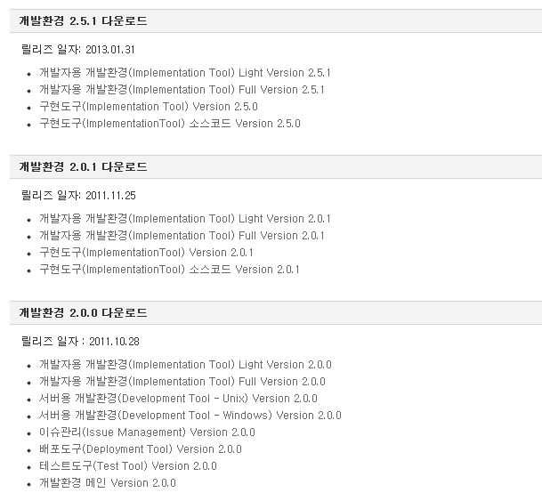

### 다운로드 상세 페이지

로그인 후에 상세페이지로 이동해서 Full Version을 다운로드합니다. 설명에도 있지만 
이클립스의 여러 가지 플러그인들이 설치되어 있는 통합 개발도구입니다.

> 개발자용 개발환경(Implementation Tool) Full Version은 개발자의 코드 작성을 
> 지원하는 도구로써, eGovFrame기반의 어플리케이션 개발을 지원하는 IDE와 
> Editor(SourceCode, UML, ERD, DBIO, WebFlow, Code Generation, 
> Code Inspection, 공통컴포넌트 생성, 맞춤형 개발환경, Nexus, SVN)와 
> Debug(Local, Remote), Mobile IDE, Batch IDE, RDT로 구성되어 있습니다.

일반적인 이클립스 Java EE 패키지가 230MB 정도인데, 2.5배의 크기입니다.

<그림> 개발환경 Full Version 2.5.1 상세 페이지  
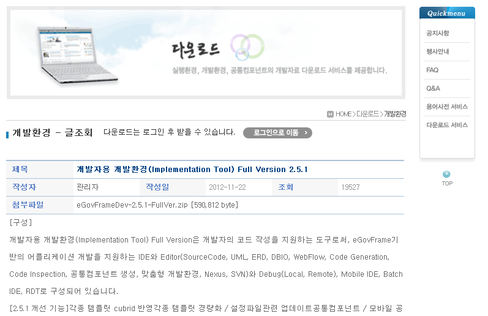

네트워크마다 속도가 다릅니다만 대략 5~10분 정도가 소요됩니다.

<그림> 개발환경 Full Version 2.5.1 다운로드  
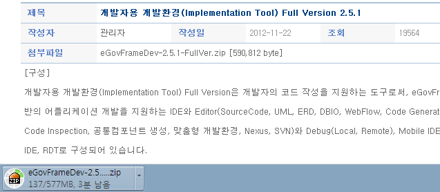

### 개발환경 도구 설치

다운로드 받은 eGovFrameDev-2.5.1-FullVer.zip 파일의 압축을 풉니다. 
eGovFrameDev-2.5.1-FullVer 폴더를 C:\ 경로로 이동합니다. 
C:\eGovFrameDev-2.5.1-FullVer 폴더 안에 eclipse 와 workspace가 보이면 
제대로 위치를 잡았습니다.

<그림> 개발환경 도구 설치 위치  
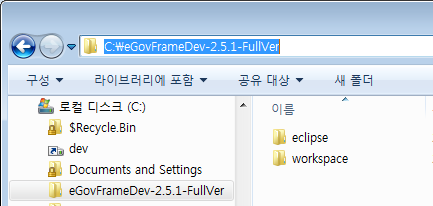

### 개발환경 서버 설치

실행하기 전에 다음 장에서 설명할 개발환경 서버를 먼저 설치합니다. 개발도구를 실행하기 
위한 jdk(Java Development Kit; 자바 개발 도구)가 함께 있기 때문입니다. 물론 
개발환경 서버 없이도 jdk가 설치되어 있다면 개발환경 도구만으로도 작업이 가능합니다. 
책에서는 개발환경 서버를 먼저 설치하고 이용하도록 설명하겠습니다. 다운로드 목록 
페이지에서 "개발환경 2.0.0 다운로드" 그룹을 보면 서버용 개발환경을 볼 수 있습니다.
윈도우를 기준으로 설명합니다.

<그림> 개발환경 2.0.0 서버용 개발환경  
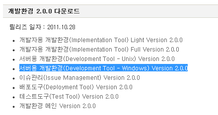

"서버용 개발환경(Development Tool - Windows) Version 2.0.0" 링크를 
클릭하고 이동하면 첨부파일이 두 가지 보입니다. eGovFrameSvr_win.2.0.0.exe 
파일과 eGovFrameSvr_Installer_가이드.docx 파일입니다. 가이드 문서 파일에는
윈도우와 리눅스 모두 설명이 되어 있습니다.

<그림> 서버용 개발환경 윈도우 버전  
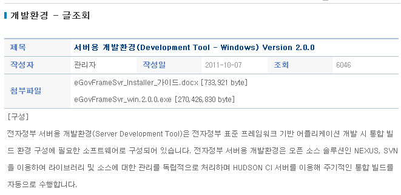

설치는 기본설정 그대로 진행합니다. 윈도우7일 경우 관리자 권한이 필요합니다. 설치를 
하게 되는 컴포넌트들은 그림과 같습니다. Tomcat, Hudson, Subversion, Maven,
Nexus 입니다. 여기 목록에는 없지만 Ant와 JDK가 포함되어 있습니다.

<그림> 서버용 개발환경 구성 컴포넌트  
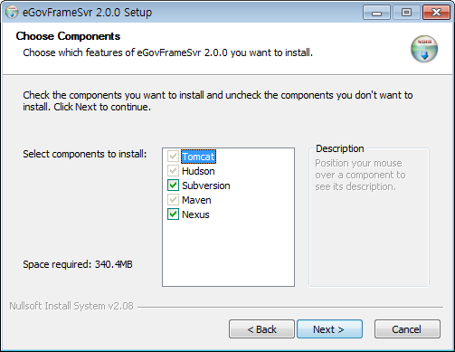

설치 경로는 기본값이 C:\eGovFrameSvr 입니다. bin 폴더 안에는 비어있지 않고, 
톰캣과 svn을 실행할 수 있는 스크립트가 있습니다. repository 폴더는 서브버전의 
소스가 위치하는 공간입니다. 자세한 설명은 다음 장으로 미루고, 자바 개발에서 가장 
중요한 환경 변수 JAVA_HOME과 Path를 설정하겠습니다.

<그림> 서버용 개발환경 설치 위치  
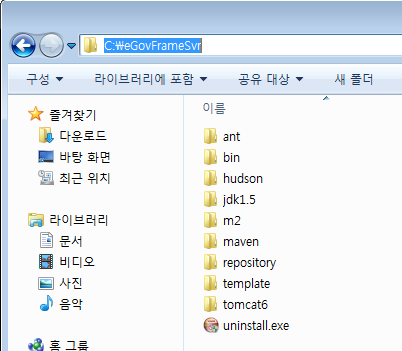

### 환경 변수 설정

환경 변수란 시스템에서 활용되는 변수를 뜻합니다. 윈도우에서는 환경 변수를 컴퓨터 속성 > 
고급 시스템 설정 > 고급 탭 > 환경 변수 > 시스템 변수 > 새로 만들기 순서로 접근해서 
만들 수 있습니다.  
윈도우 탐색기에서 컴퓨터를 선택합니다. 컨텍스트 메뉴(마우스 오른 버튼 클릭시 나오는 메뉴, 
문맥에 따라 항목이 바뀌는 메뉴)에서 속성을 선택합니다.  
<그림> 컴퓨터 속성    
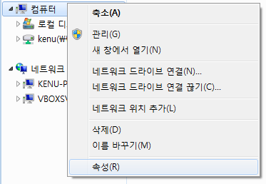  

시스템 창에서 왼쪽 메뉴들 중 고급 시스템 설정을 클릭합니다. 윈도우XP에서는 바로 다음으로 
넘어갑니다.  
<그림> 고급 시스템 설정    
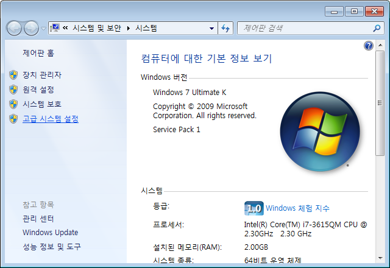  

상단 탭 중에서 고급 탭을 선택합니다. 아래에 환경 변수 버튼이 보이고, 그 버튼을 클릭해서 
환경 변수를 수정할 수 있는 창으로 이동합니다.  
<그림> 고급, 환경 변수    
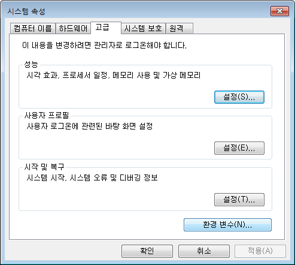  

사용자 변수와 하단에 시스템 변수로 나뉘어 있습니다. 윈도우는 일반적으로 사용자가 시스템을 
관리할 수 있는 시스템 권한을 갖고 있기 때문에 시스템 변수를 변경하겠습니다. 시스템 변수 쪽에 
있는 새로 만들기 버튼을 클릭합니다.  
<그림> 시스템 변수  
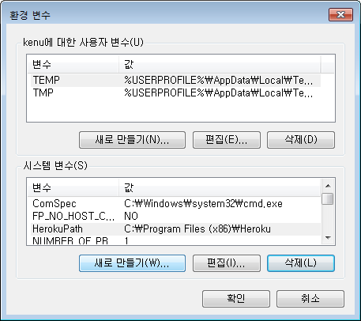  

새 시스템 변수 이름을 JAVA_HOME 그리고 변수 값에는 jdk 폴더 경로를 입력합니다. 
C:\eGovFrameSvr\jdk1.5 를 변수 값으로 넣었습니다.  
<그림> 환경 변수 JAVA_HOME  
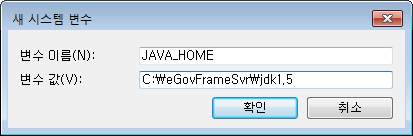  

JAVA_HOME 환경 변수 추가한 후에 이를 이용한 Path 환경 변수를 수정합니다. Path를 
선택하고 편집 버튼을 클릭합니다.   
<그림> 환경 변수 Path    
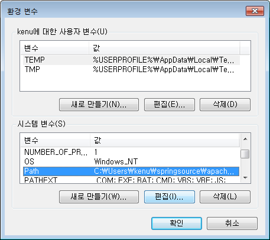  

변수 값 제일 앞으로 이동해서 %JAVA_HOME%\bin; 를 추가합니다. JAVA_HOME 환경 변수 앞 
뒤로 %를 붙여서 사용하고, 그 뒤에 \bin폴더를 더합니다. ;(세미콜론)으로 폴더값 간에 구분을 
짓습니다. Path는 시스템 어디 위치에서든 접근할 수 있는 경로들이 모아진 환경 변수입니다.  
<그림> 환경 변수 Path, %JAVA_HOME%\bin;    
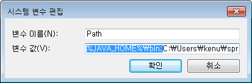  

이제 환경 변수 설정은 모두 마쳤습니다. 정리하자면 JAVA_HOME의 bin 폴더에 있는 자바 관련 
파일들을 시스템 어디에서나 접근하기 위한 환경을 마련하는 절차였습니다. 이제 표준프레임워크를 
시작할 준비가 다 되었습니다.

### 개발환경 도구 시작

자바가 실행될 수 있는 환경이 준비되었다면 표준프레임워크 개발 도구를 시작할 수 있습니다. 
윈도우 탐색기에서 C:\eGovFrameDev-2.5.1-FullVer\eclipse 폴더로 이동해서 
eclipse.exe 파일을 실행합니다.  
<그림> 개발환경 도구 경로  
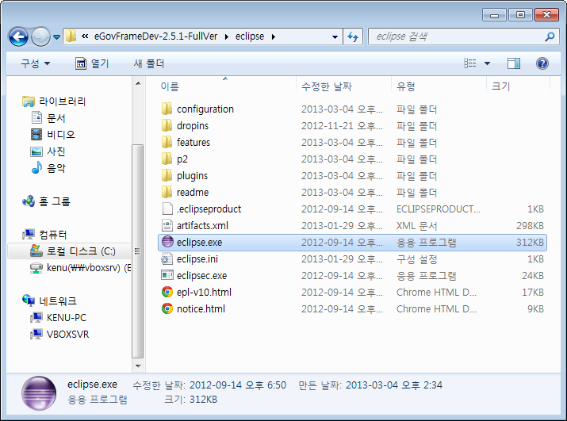  

이클립스 이미지 대신 행안부 로고가 좌측 상단에 보이는 표준프레임워크 2.5 스플래시 이미지가 
보입니다.  
<그림> 개발환경 도구 스플래시  
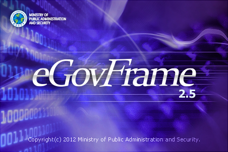  

워크스페이스를 설정하는 창이 뜹니다. C:\eGovFrameDev-2.5.1-FullVer\workspace 경로를 
확인합니다. 프로젝트 그룹의 기준 디렉토리가 워크스페이스입니다. 소스 파일들이 위치하게 됩니다. 
참고로 워크스페이스마다 .metadata 라는 폴더를 포함하는데, 여기에 이클립스의 설정 정보가 
저장됩니다. 이 때문에 워크스페이스를 변경하면 이클립스를 리셋하는 효과가 나타납니다.  
<그림> 워크스페이스 경로  
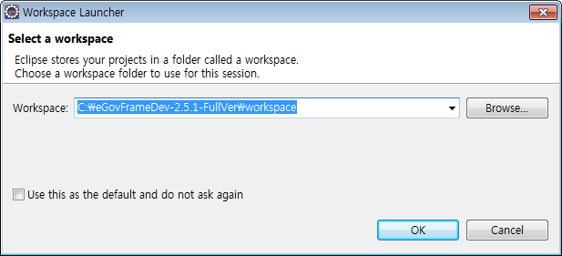  

## 개발환경 서버

## 개발환경 도구

## 실행환경

## 실행환경 구성

