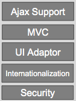
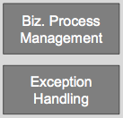
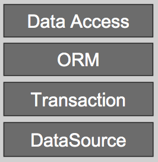
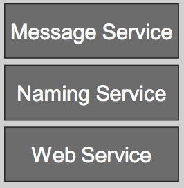
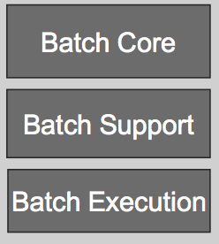
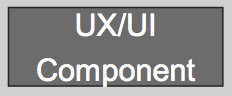
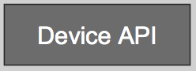

## 실행환경
전자정부 표준프레임워크의 실행환경은 스프링 프레임워크를 중심으로 구성되어 있습니다. 개발환경이 개발의 편이성을 위해서 구성되어 있다면, 실행환경은 실제 서비스에 배포되는 프레임워크와 라이브러리로 구성되어 있습니다. 실행환경의 중심이 되는 스프링 프레임워크에 대한 이해가 있다면 애플리케이션 개발이 어렵지 않을 것입니다. 실행환경 구성을 살펴보고 스프링 프레임워크의 기본을 다루어 보겠습니다.

### 실행환경 개요  
실행환경은 8가지 서비스 그룹으로 구성됩니다. 그림과 같이 공통기반 위에 화면처리, 업무처리, 데이터처리, 연계통합, 배치처리, 모바일 화면처리, 모바일 디바이스 API 레이어(Layer)들이 있습니다.   

<그림> 실행환경 구성 (2.6)  

#### 공통기반 (Foundation Layer)  
공통기반 레이어는 아래 그림과 같이 구성되어 있습니다. 20가지 기능별 컴포넌트들은 실행환경의 각 레이어에서 공통적으로 사용되는 기능을 제공합니다.    
<그림> 공통기반 레이어 구성  

AOP, Cache, Compress/Decompress, Encryption/Decryption, Excel, File Handling, File Upload/Download, FTP, ID Generation, IoC Container, Logging, Mail, Marshalling/Unmarshalling, Object Pooling, Property, Resource, Scheduling, Server Security, String Uril, XML Manipulation 이상 20가지의 공통기능을 제공합니다.
이 중에서 가장 주의깊게 봐야할 것이 IoC Container입니다. 스프링의 핵심이고, 이것을 기준으로 표준프레임워크의 애플리케이션 패턴이 이루어집니다. 나머지 기능들도 각기 중요한 역할을 하기 때문에 후반에 하나씩 살펴보겠습니다.   

#### 화면처리 (Presentation Layer)  
화면처리 레이어는 MVC(Model-View-Controller) 패턴에서 View에 해당합니다. 화면처리 레이어의 구성은 다음과 같습니다.  
<그림> 화면처리 레이어 구성  
  

Spring MVC, Internationalization, Ajax Support, Security, UI Adaptor 이상 5가지 기능을 제공합니다.  
MVC 패턴의 프레임워크는 스프링 MVC, 스트럿츠(Struts), 웹워크(Webwork) 등이 있지만, 표준프레임워크에서는 스프링 MVC를 채택하였습니다.  
국제화(Internationalization) 기능은 다국어를 처리하는 방법입니다. 스프링 MVC의 LocaleResolver를 이용합니다. 브라우저 헤더, 세션, 쿠키 등에 있는 언어 정보를 이용해서 해당 언어로 페이지를 보여주는 기능입니다.  
Ajax 지원은 AjaxTags 라이브러리를 이용합니다. Ajax를 이용해 자주 사용되는 기능을 custom tag형태로 제공합니다.  
인증, 권한 같은 일반적인(통상적인) 개념의 Security 서비스는 Spring Security를 활용한 공통기반 레이어에
서 제공합니다. 화면처리 레이어의 Security 서비스는 입력값 유효성 검증 기능을 제공한다. 스프링과 연결되는 자카르타 커먼스 밸리데이터(Jakarta Commons Validator)를 이용합니다.  
UI 어댑터는 표준프레임워크와 RIA(Rich Internet Application) 솔루션을 연결하기 위한 기능입니다. 마이플랫폼 등의 상용 솔루션과 연결을 지원하는 기능입니다.  
  

#### 업무처리 (Business Logic Layer)  
업무처리 레이어는 업무 프로그램의 업무 로직을 담당하는 레이어로서, 업무 흐름 제어, 에러 처리 등의 기능을 제공합니다.  
<그림> 업무처리 레이어 구성  
  

업무처리 레이어는 Spring Web Flow, Spring 이상 2가지 오픈소스를 사용합니다.  
프로세스 제어(Process Control)을 담당하는 웹 플로우는 페이지 흐름(flow)의 정의와 수행을 처리합니다.  
에러 처리(Exception Handling)는 표준프레임워크 기반의 시스템 개발시 Exception에 따라서 특정 로직을 실행하여 Exception에 따라 적절한 대응을 할 수 있습니다.  

#### 데이터처리 (Persistence Layer)  
데이터처리 레이어는 데이터를 다루는 역할을 전담하며, 데이터베이스에 대한 연결 및 영속성 처리, 선언적인 트랜잭션 관리를 제공합니다. 데이터처리 레이어의 구성은 다음과 같습니다.  

<그림> 데이터처리 레이어 구성  
  

데이터소스(DataSource)와 트랜잭션(Transaction)은 스프링을 사용합니다.  
데이터 접근(Data Access)는 iBatis를 사용하고 있으며, SQL Mapper를 통해서 XML로 정의된 SQL을 활용합니다.  
ORM(Object-Relational Mapping)은 하이버네이트(Hibernate)를 사용하고 있습니다. 하이버네이트는 자바 객체와 관계형 데이터 모델 간의 매핑을 위한 도구이며, 자동 생성된 쿼리 서비스를 지원하는 강력한 고성능의 퍼시스턴스 프레임워크입니다.

#### 연계통합 (Integration Layer)  
연계통합 레이어는 다른 시스템과 데이터 교환을 지원하는 역할을 합니다. 연계통합 레이어의 구성은 다음과 같습니다.  

<그림> 연계통합 레이어 구성  
  

Naming Service, Integration Service, Web Service 등 총 3개 서비스를 제공합니다.  
네이밍 서비스(Naming Service)는 스프링을 이용합니다.  
인테그레이션 서비스(Integration Service)는 표준프레임워크 기반의 시스템이 다른 시스템과의 연계를 위해 사용하는 Interface의 표준을 정의한 것입이다.  
웹 서비스(Web Service)는 아파치 CXF를 사용합니다. 공개되어 있는 웹 서비스를 호출하고, 처리 결과를 돌려줍니다. 개발한 업무 모듈을 웹 서비스로 공개할 수 있도록 프록시(Proxy) 등을 제공하고, 완성된 웹 서비스로 공개합니다.

#### 배치처리 (Batch Layer)  

<그림> 배치처리 레이어 구성  
  

#### 모바일 화면처리 (Mobile Presentation Layer)  

<그림> 모바일 화면처리 레이어 구성  
  

#### 모바일 디바이스 API (Mobile Device API Layer)  

<그림> 모바일 디바이스 API 레이어 구성  
  

### 스프링 프레임워크  
스프링 프레임워크는 2004년 로드 존스의 development J2EE without EJB 라는 책이 시발점이 되었습니다. 무거운 EJB 없이도, J2EE 스택과 연계된 개발이 가능하다는 것이었고, 당시에는 경량(Light Weight) 프레임워크라는 이름이 함께 따라 다녔습니다. 스프링 프레임워크의 핵심 개념에는 비즈니스 로직의 POJO(Plain Old Java Object)를 중심으로 제어의 역전(Inversion of Control;IoC)/의존성 주입(Dependency Injection;DI), AOP(Aspect Oriented Program), 서비스 추상화(Portable Service Abstraction; PSA), 이상 세 가지 컨셉으로 구성되어 있습니다.  

### 스프링 IoC/DI  

### 스프링 MVC  

## 실행환경 구성

### MyBatis와 데이터베이스  

### 오픈소스 프로젝트 소개

## 공통 컴포넌트  

### 공통 컴포넌트 구성  

## 모바일 표준프레임워크  
스마트폰의 등장과 생활 속에서 강력한 파급효과를 보이면서, 업무를 모바일 환경에서 적용하려는 노력이 많아지고 있습니다. 스마트폰에 있는 웹브라우저는 가장 발전이 빠른 웹킷엔진을 사용하고 있습니다. 품질이 좋은 오픈소스가 많이 활용되기 때문입니다. 

### 모바일 표준프레임워크 구성  

#### jQueryMobile 
#### viewport

