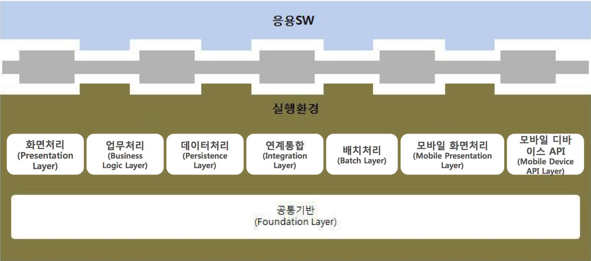

## 실행환경
전자정부 표준프레임워크의 실행환경은 스프링 프레임워크를 중심으로 구성되어 있습니다. 개발환경이 개발의 편이성을 위해서 구성되어 있다면, 실행환경은 실제 서비스에 배포되는 프레임워크와 라이브러리로 구성되어 있습니다. 실행환경의 중심이 되는 스프링 프레임워크에 대한 이해가 있다면 애플리케이션 개발이 어렵지 않을 것입니다. 실행환경 구성을 살펴보고 스프링 프레임워크의 기본을 다루어 보겠습니다.

### 실행환경 개요  
실행환경은 8가지 서비스 그룹으로 구성됩니다. 그림과 같이 공통기반 위에 화면처리, 업무처리, 데이터처리, 연계통합, 배치처리, 모바일 화면처리, 모바일 디바이스 API 레이어들이 있습니다.   

<그림> 실행환경 구성 (2.6)  

### 스프링 프레임워크  

### 스프링 IoC/DI  

### 스프링 MVC  

## 실행환경 구성

### MyBatis와 데이터베이스  

### 오픈소스 프로젝트 소개

## 공통 컴포넌트  

### 공통 컴포넌트 구성  

## 모바일 표준프레임워크  
스마트폰의 등장과 생활 속에서 강력한 파급효과를 보이면서, 업무를 모바일 환경에서 적용하려는 노력이 많아지고 있습니다. 스마트폰에 있는 웹브라우저는 가장 발전이 빠른 웹킷엔진을 사용하고 있습니다. 품질이 좋은 오픈소스가 많이 활용되기 때문입니다. 

### 모바일 표준프레임워크 구성  

#### jQueryMobile 
#### viewport

